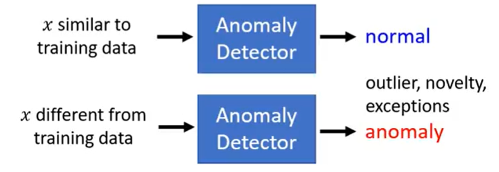
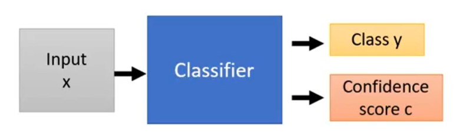
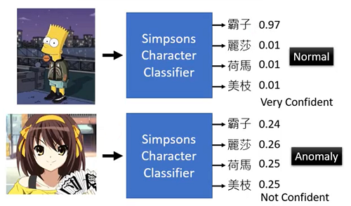
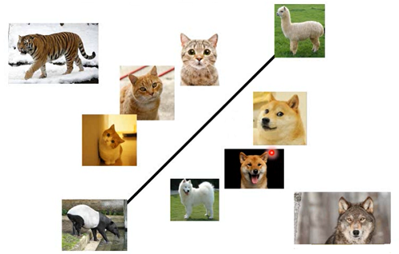

# Hung-yi Lee 学习笔记: Anomaly Detection
[学习视频链接](https://www.bilibili.com/video/av48285039/?p=13) (文中例子均来自视频) 
## Problem Formulation
+ 给定一个训练集${x^1,x^2,x^3,...,x^N}$
+ 我们想要找到一个函数来检测输入的$x$是否和训练集的数据是相似的
&emsp;&emsp;&emsp;&emsp;&emsp;&emsp;&emsp;&emsp;&emsp;&emsp;&emsp;&emsp; 

## With Classifier
### Example Application
+ 判断输入的$x$是否是辛普森一家中的人物 
&emsp;&emsp;&emsp;&emsp;&emsp;&emsp;&emsp;&emsp;&emsp;&emsp;&emsp;&emsp; 
&emsp;&emsp;&emsp;&emsp;&emsp;&emsp;&emsp;&emsp;&emsp;&emsp;&emsp;&emsp;&emsp;&emsp;&emsp;&emsp;&emsp;&emsp;&emsp;&emsp; 
&emsp;&emsp;辛普森一家的人物是拥有名字(标签)的,当我们训练一个辛普森一家家庭成员的分类器后,输入一张其他情况下的家庭成员照片后,分类器会给出对应的家庭成员的名称.
### How to use the Classifier
&emsp;&emsp;&emsp;&emsp;&emsp;&emsp;&emsp;&emsp;&emsp;&emsp;&emsp;&emsp; 
&emsp;&emsp;为了使得我们的分类器可以做异常侦测,我们的分类器在最后不仅要输出$x$的所属类别,还要输出其对应的信心分数(Confidence score c).而后给定一个阈值$\lambda$,使得$f(x)=$:
$$normal, &emsp;  if &emsp; c(x) > \lambda$$
$$anomaly,&emsp;  if &emsp; c(x) ≤ \lambda$$
&emsp;&emsp;&emsp;&emsp;&emsp;&emsp;&emsp;&emsp;&emsp;&emsp;&emsp;&emsp; 
&emsp;&emsp;当我们给出属于辛普森一家的成员"霸子"的图片后,正常的分类器会返回这张图片属于哪一个家庭成员的概率,图中分类器检测得到的图片属于"霸子"的概率为0.97.当我们输入另外一张不属于辛普森家庭的图片后,分类器也会输出其属于哪一个家庭成员的概率,但可以明显的发现机器在检测"霸子"时是有信心的(输出中图片是"霸子"的概率高达"97%"),而检测"凉宫春日"时是没有信心的(输出中每个类别的概率都很低).通过信心程度的不同,就可以判断"凉宫春日"这张图片是异常的.但这只是定性分析,我们需要将信心分数量化. 
&emsp;&emsp;一种比较简单的量化信心分数的方法是: 输出分类器中得分最高的概率值作为信心分数. 
&emsp;&emsp;还可以使用信息熵来进行判断: 当图片属于某一个类别的概率越高,其紊乱的程度越低.
### Example Framework
+ 训练集: 训练集的数据都是辛普森一家的图片,每一个图片都有其对应的标签(任务名称).训练分类器,并且从分类器中获得信心分数和异常检测函数$f(x)$.
+ 验证集: 验证集的数据分为辛普森一家和不属于辛普森一家的图片.通过调整$\lambda$以及其他超参数的值来计算$f(x)$的表现.
+ 测试集: 测试集使用验证集验证后的模型判断图片是否属于辛普森一家,并测试准确度.
### Possible Issues
&emsp;&emsp;&emsp;&emsp;&emsp;&emsp;&emsp;&emsp;&emsp;&emsp;&emsp;&emsp; 
&emsp;&emsp;图示的普通二元分类器在做异常检测时就会出现问题,例如当有一只老虎出现时,因为其特征和猫很相似,所以其会被划分到猫类别中,而事实上它是需要被当作异常值检测的.
## Without Labels
&emsp;&emsp;当数据集没有打上标签时,这个时候我们不能做出一个分类器来评估信心分数从而做出检测.在这种情况下,我们可以建立一个模型,它可以生成$P(x)$,一个关于$x$分布的模型.
### Maximum Likelihood
&emsp;&emsp;假设数据点是从一个概率密度函数$f_{\theta}(x)$中采样得到的: 

+ $\theta$决定了$f_{\theta}(x)$的形状
+ $\theta$是未知的,需要从数据中估计 

&emsp;&emsp;使用最大似然估计对参数$\theta$进行估计,一般使用高斯分布.参数确定好后,就可以通过和给定阈值$\lambda$比较,进行异常值检测.