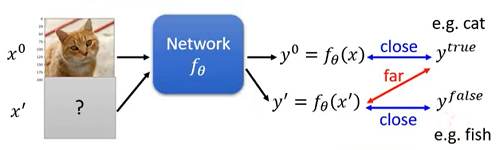

# Hung-yi Lee 学习笔记: Atttack and Defence
[学习视频链接](https://www.bilibili.com/video/av48285039?p=24) (文中例子均来自视频) 
## Attack
### What do we want to do?
&emsp;&emsp;&emsp;&emsp;&emsp;&emsp;&emsp;&emsp;&emsp;&emsp;&emsp;&emsp;&emsp; 
&emsp;&emsp;我们想要给一个原始图像$x^0$加上人为特殊制造的噪音$\delta{x}$,使得新生成的攻击图像使网络给出一个完全错误的结果.那这样的噪音如何生成呢?
###  Loss Function for Attack
&emsp;&emsp;&emsp;&emsp;&emsp;&emsp;&emsp;&emsp;&emsp;&emsp;&emsp;&emsp;&emsp; 

+ 正常训练:训练一个有用的神经网络时我们损失函数写成:
$$L\_{train}(\theta)=C(y^0,y^{true})$$
&emsp;&emsp;训练过程中$x$固定.
+ 无目标攻击: 
&emsp;&emsp;&emsp;&emsp;&emsp;&emsp;&emsp;&emsp;&emsp;&emsp;&emsp;&emsp;&emsp; 
&emsp;&emsp;我们要找出一个$x^{'}$使得通过神经网络的输出与真实的输出越远越好,这样的攻击叫做无目标攻击.待优化的损失函数为:
$$L(x^{'})=-C(y^0,y^{true})$$
&emsp;&emsp;训练过程中$\theta$固定.
+ 有目标攻击: 
&emsp;&emsp;&emsp;&emsp;&emsp;&emsp;&emsp;&emsp;&emsp;&emsp;&emsp;&emsp;&emsp; 
&emsp;&emsp;在有目标攻击中我们要找出一个$x^{'}$使得通过神经网络的输出与真实值越远越好,与我们给定的错误值越近越好(例如一张鱼的图片).待优化的损失函数为:
$$L(x^{'})=-C(y^0,y^{true})+C(y^0,y^{false})$$
&emsp;训练过程中$\theta$固定.
+ 额外限制
$$d(x^{0},x^{'}≤\epsilon)$$
&emsp;&emsp;我们希望我们生成的图片与原始的图片距离接近,因为如果生成的$x^{'}$和原始的$x^{0}$差别过大的话,神经网络自然会将错误的输入判别为不是猫的类中(在有目标攻击中,我们根据损失函数生成了和鱼很像的图片,不加约束的话那这张图就是张鱼,进入神经网络根本没有攻击效果).
### Constraint 
$$\begin{bmatrix}
x\_{1}^{'}\\
x\_{2}^{'}\\
x\_{3}^{'}\\
\vdots\\ 
\end{bmatrix}-\begin{bmatrix}
x\_{1}\\
x\_{2}\\
x\_{3}\\
\vdots\\
\end{bmatrix}=\begin{bmatrix}
\Delta x\_{1}\\
\Delta x\_{2}\\
\Delta x\_{3}\\
\vdots\\
\end{bmatrix}
$$
$$x^{'}-x^{0}=\Delta x$$

+ L2_norm(2范数)
$$d(x^{0},x^{'})=||x^{0}-x^{'}||\_{2}$$
$$=(\Delta x\_{1})^2+(\Delta x\_{2})^2+(\Delta x\_{3})^2+\cdots$$
+ L-infinity(无穷范数)
$$d(x^{0},x^{'})=||x^{0}-x^{'}||\_{\infty}$$
$$=max\Delta x\_{1},\Delta x\_{2},\Delta x\_{3},\cdots $$
### How to Attack
&emsp;&emsp;和训练普通的神经网络一样,不过伸进网络参数由$\theta$变成了$x^{'}$
$$x^{*}=\mathop{\arg\min}\_{d(x^{0},x^{'}≤\epsilon)}L(x^{'})$$

+ 修正后的梯度下降 
&emsp;&emsp;由于当前的优化是带有约束条件的优化,所以需要修改原始的梯度下降方法: 
&emsp;&emsp;&emsp;&emsp;&emsp;&emsp;&emsp;&emsp;&emsp;&emsp;&emsp;&emsp;&emsp; 
&emsp;&emsp;每次循环中有一次约束判断,如果$d(x^{0},x^{t}>\epsilon)$,则穷举所有满足$d(x^{0},x≤\epsilon)$的点,并找出与$x^{t}$最接近的$x$来替换$x^{t}$
### Example
&emsp;&emsp;&emsp;&emsp;&emsp;&emsp;&emsp;&emsp;&emsp;&emsp;&emsp;&emsp;&emsp; 
&emsp;&emsp;视频中使用训练好的残差神经网络,错误图片使用键盘生长了一张攻击图片,这张图片看起来和原始的小猫图片几乎一模一样,但是它被神经网络辨认为了键盘,而且其置信度有0.98之高.看来特定的$\Delta x$对神经网络的影响确实很大.
### Attack Approaches
&emsp;&emsp;&emsp;&emsp;&emsp;&emsp;&emsp;&emsp;&emsp;&emsp;&emsp;&emsp;&emsp; 
&emsp;&emsp;攻击方式有很多,不过一般都是修改损失函数或者距离约束来达到要求.
+ Fast Gradient Sign Method(FGSM) 
&emsp;&emsp;&emsp;&emsp;&emsp;&emsp;&emsp;&emsp;&emsp;&emsp;&emsp;&emsp;&emsp;&emsp;&emsp; 
&emsp;&emsp;FGSM将$\Delta x$的每一维的微分都用符号函数转换为+1(大于0时为1)或者-1(小于0时为-1),$x^{\*}$就是原始$x^0$加减$\epsilon\_{i}$的结果,经过一次操作后生成攻击模型. 
简单解释就是,将FGSM理解为每个维度的微分最终都转化到距离约束的最大值上,而这个最大距离$\epsilon$就是一个相对而言很大的学习率,使得梯度下降一次就达到目的,同时还满足约束条件.使得FGSM只注重梯度方向,而不注重梯度大小.
### White Box v.s. Black Box
+ 在前面所述中,我们固定了网络的参数$\theta$，生成$x^{'}$
+ 要攻击成功,就需要知道网络的参数$\theta$
   + 需要知道网络参数的攻击叫做White Box Attack(白箱攻击)
+ 不公开模型会安全吗?
   + 只提供线上调用的API而不公开整个模型
+ 不一定哦,Black Box Attack(黑箱攻击)也是存在的.
### Black Box Attack
&emsp;&emsp;&emsp;&emsp;&emsp;&emsp;&emsp;&emsp;&emsp;&emsp;&emsp;&emsp;&emsp;&emsp;&emsp; 
&emsp;&emsp;如果我们有目标网络的训练数据,我们就可以自己训练一个神经网络(Proxy Network),然后使用自己训练的神经网络来进行产生攻击对象.这样的方式中我们只要拥有训练数据就可以,也不必一定要知道被攻击的模型的架构.即使我们没有训练数据,我们也可以通过投入给被攻击模型的线上API来返回的结果组成训练集来生成攻击的模型.
## Defense
+ 两种防御手段:
	+ 被动防御:不修改已经训练好的模型,而找出攻击图片
	+ 主动防御:训练一个面对攻击时能够保持稳健的模型