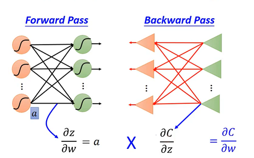

# Hung-yi Lee 学习笔记: Backpropagation
[学习视频链接](https://www.bilibili.com/video/av48285039/?p=9) (文中例子均来自视频) 
## Chain Rule
&emsp;&emsp;&emsp;&emsp;&emsp;&emsp;&emsp;&emsp;&emsp;&emsp;&emsp;&emsp; 
&emsp;&emsp;上图是关于链式法则的简单回顾. 
&emsp;&emsp;&emsp;&emsp;&emsp;&emsp;&emsp;&emsp;&emsp;&emsp;&emsp;&emsp; 
&emsp;&emsp;上图中$C^n$表示将一个训练数据$x^n$输入神经网络得到的预测值$y^n$与真实值$\hat y^n$的距离.将所有训练集输入后得到的每一个$c^i$加和就求得了模型总的损失:
$$L(\theta)=\sum\_{n=1}^{N}C^{n}(\theta)$$
&emsp;&emsp;对其求偏导就是:
$${\frac{\partial L(\theta)}{\partial w}}=\sum\_{n=1}^{N}\frac{\partial{C^n(\theta)}}{\partial{w}}$$
&emsp;&emsp;&emsp;&emsp;&emsp;&emsp;&emsp;&emsp;&emsp;&emsp;&emsp;&emsp; 
&emsp;&emsp;如何求得上图中的$\frac{\partial{C}}{\partial{w}}$?,可以使用链式法则将原式拆解成$\frac{\partial{z}}{\partial{w}}\frac{\partial{C}}{\partial{z}}$.
&emsp;&emsp;$\frac{\partial{z}}{\partial{w}}$的计算是同过前向传递(Forward pass)进行的,而$\frac{\partial{C}}{\partial{z}}$的计算是同过后向传递(Backward pass)进行的.
## Backpropagation - Forward pass
&emsp;&emsp;前向计算很简单,上图中$\frac{\partial{z}}{\partial{w_1}}=x_1$,$\frac{\partial{z}}{\partial{w_2}}=x_2$. 
&emsp;&emsp;&emsp;&emsp;&emsp;&emsp;&emsp;&emsp;&emsp;&emsp;&emsp;&emsp; 
&emsp;&emsp;上图是一个简单的前向传播过程.
## Backpropagation - Backward pass
&emsp;&emsp;后向传播要计算的是$\frac{\partial{C}}{\partial{z}}$,这相较于前向传播更加困难一些,因为是对$C$的微分,所以得一直延申到输出层才可以知道$C$的函数,这就得使用链式法则层层微分,最后得到结果. 
&emsp;&emsp;&emsp;&emsp;&emsp;&emsp;&emsp;&emsp;&emsp;&emsp;&emsp;&emsp; 
&emsp;&emsp;上图是一个简单后前向传播过程.
## Backpropagation - Summary
&emsp;&emsp;&emsp;&emsp;&emsp;&emsp;&emsp;&emsp;&emsp;&emsp;&emsp;&emsp; 
&emsp;&emsp;通过前向传递和后向传递后就可以对$\frac{\partial{C}}{\partial{w}}$进行计算了,在得到$\frac{\partial{C}}{\partial{w}}$后就可以使用梯度下降来更新参数来最小化模型误差了.