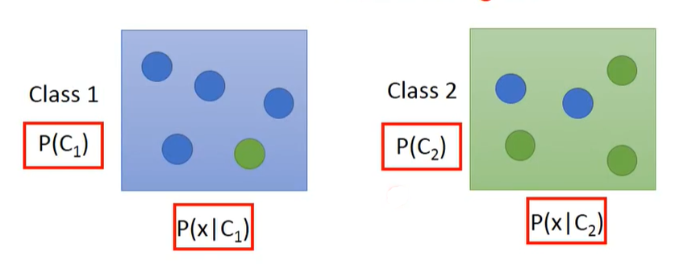
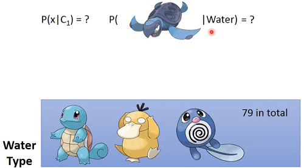
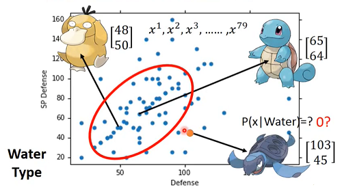
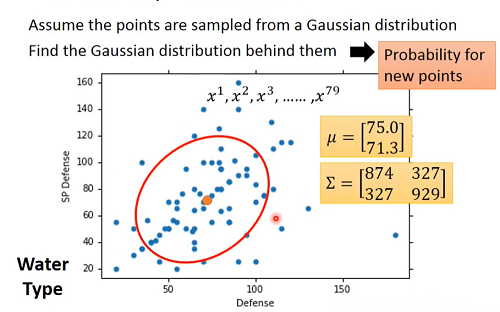
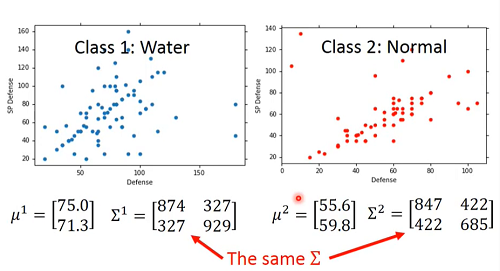
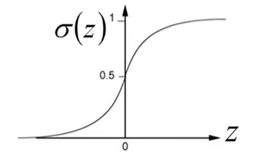

# Hung-yi Lee 学习笔记: Classification
[学习视频链接](https://www.bilibili.com/video/av48285039/?p=9) (文中例子均来自视频) 
## Two Classes
 
&emsp;&emsp;现有类别1和类别2两种类别,给定一个$x$,求出其属于某一个类别概率可以表示为:
$$P(C_1|x)=\frac{P(x|C_1)P(C_1)}{P(x|C_1)P(C_1)+P(x|C_2)P(C_2)}        (1)$$
&emsp;&emsp;其中$P(C_1)$表示类别1出现的概率,$P(C_2)$表示类别2出现的概率,$P(x|C_1)$表示类别1出现的情况下$x$出现的概率,$P(x|C_2)$表示类别1出现的情况下$x$出现的概率.而这4个概率需要从训练数据中估测得到.这种模型被称为生成式模型(Generative Model).有了这个模型,我们便可以计算某一个$x$出现的机率,从而得到$x$的分布,继而产生一个$x$.这个机率可以表示为: $P(x)=P(x|C_1)P(C_1)+P(x|C_2)P(C_2)$.
## Prior
&emsp;&emsp;训练集中现有79只水系宝可梦(Class 1),61只普通系宝可梦(Class 2).容易得到$P(C_1)=\frac{79}{79+61}$,$P(C_2)=\frac{61}{79+61}$.这两个先验概率是训练集中的频率近似替代的结果,而非真正的概率值.
## Probility from Class
&emsp;&emsp;现在有一个问题,如何计算一个没有出现在类别1中的$x$的值,即$P(x|C_1)=?$. 
&emsp;&emsp;&emsp;&emsp;&emsp;&emsp;&emsp;&emsp;&emsp;&emsp;&emsp;&emsp;&emsp;&emsp; 
&emsp;&emsp;虽然图中的海龟没有出现在79只水系宝可梦中,但其是真实存在的,只是我们的训练集中没有采集到这个海龟的样本. 
&emsp;&emsp;&emsp;&emsp;&emsp;&emsp;&emsp;&emsp;&emsp;&emsp;&emsp;&emsp;&emsp;&emsp; 
&emsp;&emsp;上图中将宝可梦转化成向量表示,为了简单起见只使用了SP Defense和Defense两个特征组成的向量.我们可以**假设水系宝可梦的Defense和SP Defense是从Gaussian distribution(高斯分布)中得出的**,当前的79个水系宝可梦是基于Gaussian distribution的抽样.而$P(x|Water)$的值,我们可以通过Gaussian distribution来得到. 
### Gaussian distribution:
$$f_{\mu,\sigma}(x)=\frac{1}{(2\pi)^{D/2}}\frac{1}{|\sigma|^{1/2}}exp{-\frac{1}{2}(x-\mu)^T\sigma^{-1}(x-\mu)}        (2)$$ 
&emsp;&emsp;&emsp;&emsp;&emsp;&emsp;&emsp;&emsp;&emsp;&emsp;&emsp;&emsp;&emsp;&emsp;&emsp;&emsp; 
&emsp;&emsp;给出一个新的$x$，如果得出了Gaussian distribution,就可以将$x$的值带入到Gaussian概率密度函数中,从而计算出其出现的概率.
### Maximum Likelihood
&emsp;&emsp;Gaussian distribution中的参数$\mu$和$\sigma$可以使用Maximum Likelihood(极大似然估计)得到. 
## Now we can do classification
&emsp;&emsp;前面引入未知宝可梦的出现的概率计算都是在为分类做准备,很容易发现当我们在求(1)式时,前面所有的准备都是在求解等式右侧的$P(x|C)$.计算结束后就可以进行分类了,如果$P(C_1|x)>0.5$,那么$x$就属于类别1(Water类别). 
## Modifying Model
&emsp;&emsp;使用79个水系宝可梦和61只普通系宝可梦得到的对应模型在测试集上的结果并不理想,我们要考虑修改模型. 
&emsp;&emsp;&emsp;&emsp;&emsp;&emsp;&emsp;&emsp;&emsp;&emsp;&emsp;&emsp;&emsp;&emsp;&emsp;&emsp; 
&emsp;&emsp;一般的做法是在两种类别上使用同一组$\sigma$,这样在训练时可以有效减少参数.
&emsp;&emsp;还是使用最大似然估计来得到参数$\mu^1,\sigma,\mu^2$:
$$L(\mu^1,\mu^2,\sigma)=f_{\mu^1,\sigma}(x^1)f_{\mu^1,\sigma}(x^2)...f_{\mu^1,\sigma}(x^{79}) × f_{\mu^2,\sigma}(x^{80})f_{\mu^2,\sigma}(x^{81})f_{\mu^2,\sigma}(x^{140})$$ 
&emsp;&emsp;值得注意的是$\sigma$的值是$\sigma^1$和$\sigma^2$的加权平均:$\sigma=\frac{79}{140}\sigma^1+\frac{61}{140}\sigma^2$.
&emsp;&emsp;在修改模型后准确率从54%上升到73%.
## Posterior Probability
$$P(C_1|x)=\frac{P(x|C_1)P(C_1)}{P(x|C_1)P(C_1)+P(x|C_2)P(C_2)}$$
$$=\frac{1}{1+\frac{P(x|C_2)P(C_2)}{P(x|C_1)P(C_1)}}$$
$$=\frac{1}{1+exp(-z)}      (3)$$
&emsp;&emsp;其中$z$等于:
$$z=ln\frac{P(x|C_1)P(C_1)}{P(x|C_2)P(C_2)}      (4)$$
&emsp;&emsp;上述(4)式就是$\sigma(z)$函数(sigmoid function). 
&emsp;&emsp;&emsp;&emsp;&emsp;&emsp;&emsp;&emsp;&emsp;&emsp;&emsp;&emsp;&emsp;&emsp;&emsp;&emsp;&emsp;&emsp;&emsp;&emsp;&emsp;&emsp;&emsp;&emsp; 
&emsp;&emsp;现在分析$\sigma(z)中$的自变量$z$的含义,首相将(4)式分解:
$$z=ln\frac{P(x|C_1)}{P(x|C_2)}+ln\frac{P(C_1)}{P(C_2)}       (5)$$ 
&emsp;&emsp;(5)中第2项可以表示为:
$$ln\frac{P(C_1)}{P(C_2)}=ln\frac{\frac{N_1}{N_1+N_2}}{\frac{N_2}{N_1+N_2}}=ln\frac{N_1}{N_2}      (6)$$
&emsp;&emsp;$P(x|C_1)$和$P(x|C_2)$可以表示为:
$$P(x|C_1)=\frac{1}{(2\pi)^{D/2}}\frac{1}{|\sigma^1|^{1/2}}exp{-\frac{1}{2}(x-\mu^1)^T(\sigma^1)^{-1}(x-\mu^1)}      (7)$$ 
$$P(x|C_2)=\frac{1}{(2\pi)^{D/2}}\frac{1}{|\sigma^2|^{1/2}}exp{-\frac{1}{2}(x-\mu^2)^T(\sigma^2)^{-1}(x-\mu^2)}      (8)$$ 
&emsp;&emsp;将(6),(7),(8)带入(5),化简得到:
$$z=ln\frac{|\sigma^2|^{1/2}}{|\sigma^1|^{1/2}}-\frac{1}{2}x^T(\sigma^1)^{-1}x+(\mu^1)^T(\sigma^1)^{-1}x-\frac{1}{2}(\mu^1)^T(\sigma^1)^{-1}\mu^1+$$
$$\frac{1}{2}x^T(\sigma^2)^{-1}x-(\mu^2)^T(\sigma^2)^{-1}x+\frac{1}{2}(\mu^2)^T(\sigma^2)^{-1}\mu^2+ln\frac{N_1}{N_2}      (9)$$ 
&emsp;&emsp;由于假设$\sigma^1=\sigma^2=\sigma$,此时对(9)式进行进一步简化:
$$z=(\mu^1-\mu^2)^T\sigma^{-1}x-\frac{1}{2}(\mu^1)^T(\sigma^1)^{-1}\mu^1+\frac{1}{2}(\mu^2)^T(\sigma^2)^{-1}\mu^2+ln\frac{N_1}{N_2}      (10)$$ 
&emsp;&emsp;令$\blod w^{\blod T}=(\mu^1-\mu^2)^T\sigma^{-1}$,观察$\frac{1}{2}(\mu^1)^T(\sigma^1)^{-1}\mu^1+\frac{1}{2}(\mu^2)^T(\sigma^2)^{-1}\mu^2+ln\frac{N_1}{N_2}$可以发现其运算后的结果是一个标量,所以可以令$b=\frac{1}{2}(\mu^1)^T(\sigma^1)^{-1}\mu^1+\frac{1}{2}(\mu^2)^T(\sigma^2)^{-1}\mu^2+ln\frac{N_1}{N_2}$,则:
$$P(C_1|x)=\sigma(w·x+b)      (11)$$ 
既然最终要求的仅仅是$w$和$b$，那我们或许更应该直接来得出我们想要的结果,如何做呢?答案是Logistic Regression(对数几率回归).