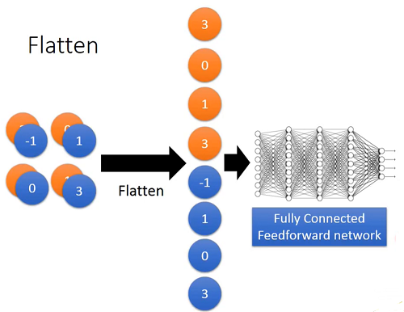

# Hung-yi Lee 学习笔记: Convolution Neural Network(CNN)
[学习视频链接](https://www.bilibili.com/video/av48285039/?p=20) (文中例子均来自视频) 
## Why CNN for Image
+ 性质1：一些图片中,待观测的模式是远小于整张图片的.对一个神经元而言,它不必观察整张图片来找寻某一模式.比如在观测图片中的鸟嘴时,不需要观测整张图片,只需要观测鸟嘴部分就可以了. 
&emsp;&emsp;&emsp;&emsp;&emsp;&emsp;&emsp;&emsp;&emsp;&emsp;&emsp;&emsp;&emsp; 
+ 性质2：图片中相同的模式出现在不同的区域中.如果不同图片待观测的鸟嘴出现在整张图片的不同位置,某一个神经元在寻找中央位置鸟嘴时,就可以共享使用左上角位置上的鸟嘴探测神经元的参数,而不必重新训练.
+ 性质3：对像素进行子采样(subsample)不会改变问题本身.我们可以通过子采样来使得图片更小,减少需要使用的参数.
## The whole CNN
&emsp;&emsp;&emsp;&emsp;&emsp;&emsp;&emsp;&emsp;&emsp;&emsp;&emsp;&emsp;&emsp; 
&emsp;&emsp;CNN一般先进入卷积层,池化层重复堆叠多次,然后进行flatten,最后进入全连接网络.训练参数比DNN要少很多.
## CNN - Convolution
&emsp;&emsp;卷积层使用过滤器(filter),这是一个矩阵,其中的参数都是需要被学习的,每一个过滤器都是一个小的模式.将这个矩阵与输入的数据矩阵进行内积,同时过滤器以一定的步长(stride)从左到右,从上到下进行内积,得到一个小于原始输入的矩阵. 
&emsp;&emsp;&emsp;&emsp;&emsp;&emsp;&emsp;&emsp;&emsp;&emsp;&emsp;&emsp;&emsp; 
&emsp;&emsp;上图显示的是过滤器1在步长为1的条件下的卷积过程. 
&emsp;&emsp;&emsp;&emsp;&emsp;&emsp;&emsp;&emsp;&emsp;&emsp;&emsp;&emsp;&emsp; 
&emsp;&emsp;使用两个过滤器得到的两个新的4x4的图片,它们合起来被称作Feature Map.
### CNN - Colorful image
&emsp;&emsp;&emsp;&emsp;&emsp;&emsp;&emsp;&emsp;&emsp;&emsp;&emsp;&emsp;&emsp; 
&emsp;&emsp;一般图片都由RGB3个通道(channel)组合而成,将图片转化为数据就是3个矩阵堆叠在一起($n×n×n$),这个时候在使用过滤器时,也要保证每个过滤器是3个矩阵堆叠在一起的($m×m×m$).在某一次卷积时,对应通道的部分数据和对应的过滤器做内积,然后将3个内积加起来获得输出.
### CNN v.s. Fully Connected
&emsp;&emsp;&emsp;&emsp;&emsp;&emsp;&emsp;&emsp;&emsp;&emsp;&emsp;&emsp;&emsp; 
&emsp;&emsp;CNN和全连接神经网络十分相似,在CNN的卷积操作中,卷积后的矩阵就相当于全连接层的隐藏层的输出,过滤器中的元素同全连接网络的参数一样,都是需要被学习的.不同之处就在于CNN在某一层的过滤器中的参数个数是固定的,在和不同的输入数据卷积时其参数都是同样的一组数字.而全连接网络中每一个输入相对于不同的输出神经元都有不同的参数.
## CNN - Max Pooling
&emsp;&emsp;&emsp;&emsp;&emsp;&emsp;&emsp;&emsp;&emsp;&emsp;&emsp;&emsp;&emsp; 
&emsp;&emsp;&emsp;&emsp;&emsp;&emsp;&emsp;&emsp;&emsp;&emsp;&emsp;&emsp;&emsp; 
&emsp;&emsp;根据过滤器1和过滤器2,得到2组$4×4$的数据.然后将输出元素4个为1组取最大值作为输出,就是最大池化操作.也可以计算4个中的平均值作为输出. 
&emsp;&emsp;&emsp;&emsp;&emsp;&emsp;&emsp;&emsp;&emsp;&emsp;&emsp;&emsp;&emsp; 
&emsp;&emsp;在经过卷操作和最大池化操作后,图片被进一步压缩成更小的维度,想到于得到一个新的图片.重复卷积和池化,获得更小的图片.
## Flatten
&emsp;&emsp;&emsp;&emsp;&emsp;&emsp;&emsp;&emsp;&emsp;&emsp;&emsp;&emsp;&emsp; 
&emsp;&emsp;Flatten的操作很简单,直接将矩阵拉直成向量就可以了.
## What does CNN learning?
&emsp;&emsp;CNN工作的过程是一个黑箱,要探知其实质内在比较困难,视频中介绍了简单了解CNN的方法. 
&emsp;&emsp;&emsp;&emsp;&emsp;&emsp;&emsp;&emsp;&emsp;&emsp;&emsp;&emsp;&emsp; 
&emsp;&emsp;上图中第一个卷积层的过滤器是比较好理解的,25个$3×3$的过滤器就是图片的25个特征刻画.但是到了第二个卷积层时就比较难解释了,因为此时原始的数据已经经过了一层卷积和最大池化操作,所以此时每个过滤器刻画的特征就不是很好解释了. 
&emsp;&emsp;如何分析一个过滤器做的事情是什么呢?可以这样来做: 
&emsp;&emsp;&emsp;&emsp;&emsp;&emsp;&emsp;&emsp;&emsp;&emsp;&emsp;&emsp;&emsp; 

+ 取出第二个卷积层的第$k$个过滤器的输出是一个$11×11$的矩阵,其中$a_{ij}^{k}$表示的是第k个过滤器的输出矩阵中第$i$行第$j$列的数据
+ 定义第$k$个过滤器被激活的度(degree)$a^k$:
$$a^k=\sum^{11}\_{i=1}\sum^{11}\_{j=1}a^{k}\_{ij}$$
+ 接下来找到一个输入的x(一张图片)使得第$k$个过滤器被激活的程度最大,即找到一个$x^{\*}$使得:
$$x^{\*}=\mathop{\arg\max}_{x}a^k(使用梯度上升解决)$$
&emsp;&emsp;&emsp;&emsp;&emsp;&emsp;&emsp;&emsp;&emsp;&emsp;&emsp;&emsp;&emsp; 
&emsp;&emsp;上图是使用梯度上升得到的部分图片,它们表示的是使得某一个过滤器的度最大的图片,也就是某一个过滤器所代表的特征的一个体现. 
&emsp;&emsp;&emsp;&emsp;&emsp;&emsp;&emsp;&emsp;&emsp;&emsp;&emsp; 
&emsp;&emsp;对于后面的过滤器以至于到flatten化后的某个神经元都可以使用这种方式来获取某个过滤器或者某个神经元所代表的特征,而越往后其所代表的特征就越复杂,上图是全连接网络中将某个特征的度最大化得到的图片. 
&emsp;&emsp;&emsp;&emsp;&emsp;&emsp;&emsp;&emsp;&emsp;&emsp;&emsp;&emsp;&emsp; 
&emsp;&emsp;考虑一个手写数字识别的CNN结构,其输出是一个10维向量,每一维代表是某个数字的可能性,现在要找出使得第$i$维最大的输入图片,我们很自然的期待那张图片是所对应的数字,但事实上机器所思所想和人类相比还是出入颇大.上图是使得输出最大的部分图片. 

&emsp;&emsp;解决这种问题的一个办法是正则化,我们即要求某一个维度的输出最大,同时要求不相关的图片的像素点$x\_{ij}$越小越好.数学表达为:
$$x^{\*}=\mathop{\arg\max}_x(y^i-\sum\_{i,j}|x_{ij}|)$$

&emsp;&emsp;&emsp;&emsp;&emsp;&emsp;&emsp;&emsp;&emsp;&emsp;&emsp;&emsp;&emsp;&emsp;&emsp; 
&emsp;&emsp;上图为加上L1正则化后的图片输出,看起来要比没有正则化的图片好一些. 
&emsp;&emsp;当前CNN在除了图像识别方面应用外还有其他的应用,自己在应用到其他领域时可以根据领域特点结合刚开始的3个性质做适当的修改.