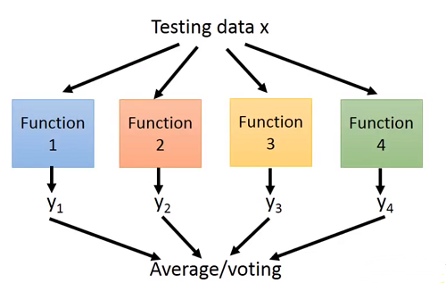

# Hung-yi Lee 学习笔记: Ensedmble 
[学习视频链接](https://www.bilibili.com/video/av48285039/?p=46) (文中例子均来自视频) 
## Framework of Ensemble
+ 获得一些分类器$f\_{1}(x),f\_{2}(x),f\_{3}(x),...$,这些分类器应该是不同的
+ 将这些分类器以适当的方式聚合在一起
## Ensemble: Bagging
&emsp;&emsp;当在不同数据集上构造**复杂模型**时,模型往往会有较大的方差(过拟合状态),但其偏差是较小的,即模型对特定数据集的拟合程度较好.现在如果我们平均不同数据集上的模型$f^{*}$,此时模型的方差减小,所得到的平均值是接近真正的模型$\hat f$的($E[f^{\*}]=\hat f$). 
&emsp;&emsp;如何制造不同的数据集呢?如果当前有N笔训练数据,我们可以对这N笔训练数据进行放回抽样抽样得到$N'$笔训练数据,当然数目上$N'$可以等于$N$,但是抽样得到的$N’$笔训练数据不会完全和原始数据相同,因为抽样过程中可能重复抽到某些数据. 
&emsp;&emsp;抽样完成后根据不同训练集构造模型: 
&emsp;&emsp;&emsp;&emsp;&emsp;&emsp;&emsp;&emsp;&emsp;&emsp;&emsp;&emsp; 
&emsp;&emsp;训练完成后将测试数据分别输入不同的模型当中然后对输出结果进行平均或者投票选择最后要输出的值: 
&emsp;&emsp;&emsp;&emsp;&emsp;&emsp;&emsp;&emsp;&emsp;&emsp;&emsp;&emsp; 
&emsp;&emsp;注意Bagging只有当模型足够复杂,容易产生过拟合时,其才会起效.举例来说,决策树就是一个容易过拟合的模型.
### Random Forest
+ Decision tree: 决策树很容易就可以在训练数据上达到0%的错误率
+ Random forest: 随机森林就是对决策树的bagging
   + 如果使用传统的采样方法,生成的决策树形状相差不大
   + 在做随机森林时比较典型的方法一般是在每一次要产生决策分支的时候,都随机决定哪一些特征是不能被使用的.
+ Out-of-bag validation of bagging: 一般在进行验证时会将训练集切分成两块,使用out-of-bag的方法则可以不经过切分就完成验证. 
&emsp;&emsp;&emsp;&emsp;&emsp;&emsp;&emsp;&emsp;&emsp;&emsp;&emsp;&emsp; 
   + 由于$f\_{2}$和$f\_{4}$分别使用数据$x^3,x^4$和$x^2,x^4$,所以使用$f\_{2}+f\_{4}$bagging的结果来测试$x^1$的错误率
   + 由于$f\_{2}$和$f\_{3}$分别使用数据$x^3,x^4$和$x^1,x^3$,所以使用$f\_{2}+f\_{3}$bagging的结果来测试$x^2$的错误率
   + 由于$f\_{1}$和$f\_{4}$分别使用数据$x^1,x^2$和$x^2,x^4$,所以使用$f\_{1}+f\_{4}$bagging的结果来测试$x^3$的错误率
   + 由于$f\_{1}$和$f\_{3}$分别使用数据$x^1,x^2$和$x^1,x^3$,所以使用$f\_{1}+f\_{3}$bagging的结果来测试$x^4$的错误率
   + 将这些错误率进行性平均就得到了对误差的良好估计
## Ensemble: Boosting(Improving Weak Classifiers)
+ Guarantee:
   + 如果一个机器学习算法可以产生一个在训练集上错误率低于50%的分类器
   + 那么这个算法在boosting后其错误率可以下降到0%
+ Framework of boosting
   + 找到第一个分类器$f\_{1}(x)$
   + 另找一个分类器$f\_{2}(x)$来帮助$f\_{1}(x)$
      + 但如果$f\_{2}(x)$和$f\_{1}(x)$太过相似的话,它就不会带来多少帮助了
      + 如何找到一个$f\_{2}(x)$使得其与$f\_{1}(x)$能够较好互补?
   + 找到第二个分类器$f\_{2}(x)$
   + 重复上述步骤,最后结合所有的分类器
+ The classifiers are learned sequentially 

### How to obtain different classifiers?
+ 如何获取不同的训练集
   + 通过重采样训练集来组成新的数据集
   + **通过赋予训练集数据不同的权重来组成新的数据集**
   + 在实际操作中,只需要改变目标函数的权重即可
   $$L(f)=\sum\_{n}l(f(x^n),\hat y^n) \rightarrow L(f)=\sum\_{n}u^nl(f(x^n),\hat y^n)$$

### Idea if Adaboost
+ Idea: 在新的训练集上训练$f\_{2}(x)$,而这个新的训练集会使得$f\_{1}(x)$的效果变差
+ 如何找到一个新的训练集使得这个$f\_{1}(x)$在这个新的数据集上效果变差?
$$先定义\varepsilon\_{1}:\ f\_{1}(x)在其训练集上的错误率$$
$$\varepsilon\_{1}=\frac{\sum\_{n} u\_{1}^{n}\delta (f\_{1}(x^{n})\neq \hat y^{n})}{Z\_{1}}<0.5$$
$$其中Z\_{1}为正则化因子:\ Z\_{1}=\sum\_{n} u\_{1}^{n}$$
&emsp;&emsp;改变训练数据的权重$u\_{1}^{n} \rightwarrow u\_{2}^{n}$使得:
$$\frac{\sum\_{n} u\_{2}^{n}\delta (f\_{1}(x^{n})\neq \hat y^{n})}{Z\_{2}}=0.5$$
&emsp;&emsp;这样做看起来就像是在新的权重下$f\_{1}$的表现就像是随机的胡乱猜测一样.然后用新的权重来训练$f\_{2}(x)$,这样训练得到的结果就是互补于$f\_{1}(x)$的. 
&emsp;&emsp;&emsp;&emsp;&emsp;&emsp;&emsp;&emsp;&emsp;&emsp;&emsp;&emsp; 

### Re-weighting Training Data
&emsp;&emsp;如果$x^{n}$被错误分类,就增加$x^{n}$的权重(乘以$d\_{1}$):
$$u\_{2}^{n} \leftarrow u\_{1}^{n} × d\_{1}$$
&emsp;&emsp;如果$x^{n}$被正确分类,就减少$x^{n}$的权重(除以$d\_{1}$):
$$u\_{2}^{n} \leftarrow u\_{1}^{n} / d\_{1}$$
&emsp;&emsp;如何得到$d\_{1}$的值呢,下面给出证明: 
&emsp;&emsp;已知:
$$\varepsilon\_{1}=\frac{\sum\_{n} u\_{1}^{n}\delta (f\_{1}(x^{n})\neq \hat y^{n})}{Z\_{1}}\ \ \ \ \ (1)$$
$$Z\_{1}=\sum\_{n}u\_{1}^{n}\ \ \ \ \ (2)$$
$$f\_{1}(x^{n})\neq \hat y^{n}\ \ u\_{2}^{n}=u\_{1}^{n}d\_{1}\ \ \ \ \ (3)$$
$$f\_{1}(x^{n})= \hat y^{n}\ \ u\_{2}^{n}=u\_{1}^{n}/d\_{1}\ \ \ \ \ (4)$$
&emsp;&emsp;需要得到
$$\frac{\sum\_{n} u\_{2}^{n}\delta (f\_{1}(x^{n})\neq \hat y^{n})}{Z\_{2}}=0.5\ \ \ \ \ (5)$$
&emsp;&emsp;(5)的分子上表示分类错误的权重,而分母是分类正确的权重,将(3),(4)带入(5)然后去倒数得到:
$$\frac{\sum\_{f\_{1}(x^{n})\neq \hat y^{n}}u\_{1}^{n}d\_{1}+\sum\_{f\_{1}(x^{n})=\hat y^{n}}u\_{1}^{n}/d\_{1}}{\sum\_{f\_{1}(x^{n})\neq \hat y^{n}}u\_{1}^{n}d\_{1}}=2\ \ \ \ \ (6)$$
&emsp;&emsp;将(6)化简得到:
$$\frac{\sum\_{f\_{1}(x^{n})=\hat y^{n}}u\_{1}^{n}/d\_{1}}{\sum\_{f\_{1}(x^{n})\neq \hat y^{n}}u\_{1}^{n}d\_{1}}=1\ \ \ \ \ (7)$$

$$\sum\_{f\_{1}(x^{n})=\hat y^{n}}u\_{1}^{n}/d\_{1}=\sum\_{f\_{1}(x^{n})\neq \hat y^{n}}u\_{1}^{n}d\_{1}\ \ \ \ \ (8)$$

$$\frac{1}{d\_{1}} \sum\_{f\_{1}(x^{n})=\hat y^{n}}u\_{1}^{n}=d\_{1}\sum\_{f\_{1}(x^{n})\neq \hat y^{n}}u\_{1}^{n}\ \ \ \ \ (9)$$
&emsp;&emsp;(1)可以化为:
$$\varepsilon=\frac{\sum\_{f\_{1}(x^{n})\neq \hat y^{n}}u\_{1}^{n}}{Z\_{1}}\ \ \ \ \ (10)$$
&emsp;&emsp;将(10)带入(9)可以得到:
$$Z\_{1}(1-\varepsilon\_{1})/d\_{1}=Z\_{1} \varepsilon\_{1} d\_{1}\ \ \ \ \ (11)$$
&emsp;&emsp;化简后即可得到$d\_{1}$的最终表达:
$$d\_{1}=\sqrt{(1-\varepsilon\_{1})/ \varepsilon\_{1}}>1$$

&emsp;&emsp;当然我们可以令:
$$\alpha\_{1}=ln\sqrt{(1-\varepsilon\_{1})/ \varepsilon\_{1}}$$
&emsp;&emsp;这样做的好处是当在后续的算法表述中更加简洁,不用针对不同情况做逻辑判断.
&emsp;&emsp;如当$x\_{1}^{n}$被分类错误时,$u\_{2}^{n}=u\_{1}^{n}d\_{1}=u\_{1}^{n}exp(\alpha\_{t})$ 
&emsp;&emsp;当$x\_{1}^{n}$被分类正确时,$u\_{2}^{n}=u\_{1}^{n}/d\_{1}=u\_{1}^{n}exp(-\alpha\_{t})$ 
&emsp;&emsp;可以看到唯一不同的区别就是$\alpha$前的正负号,此时将上述表达整合成:
$$u\_{2}^{n} \leftarrow u\_{1}^{n}exp(-\hat y^{n}f\_{t}(x^{n})\alpha\_{1})$$
&emsp;&emsp;这样就简化了表达所需要的篇幅
### Algorithm for AdaBoost
+ 给定训练集:${(x^{1},\hat y^{1},u\_{1}^{1}),\dots,(x^{2},\hat y^{2},u\_{1}^{2}),\cdots,(x^{N},\hat y^{N},u\_{1}^{N})}$
  + 二分类标签$\hat y=\pm$,初始化权重$u\_{1}^{n}=1$
+ For $t=1,\cdots,T:$
   + 在权重${u\_{t}^{1},\cdots,u\_{t}^{N}}$下训练弱分类器$f\_{t}(x)$
   + 计算当前模型的分类错误率$\varepsilon\_{t}$
   + For $n=1,\cdots,N$:
      + $u\_{2}^{n} \leftarrow u\_{1}^{n}exp(-\hat y^{n}f\_{t}(x^{n})\alpha\_{1})$

&emsp;&emsp;在训练完成后我们得到了$T$个弱分类器,如何将他们聚合起来呢?
+ 一种简单的方法是将$t$个若分类器的结果加起来,如果其结果为正就为类别1,否则就为类别2.
$$H(x)=sign(\sum\_{t=1}^{T}f\_{t}(x))$$
+ 因为弱分类器的性能有好有坏,所以在使用时可以考虑对不同的弱分类器进行加权求和,权重就是上文提到的$\alpha\_{t}$,可以知道如果一个弱分类器的错误率较低的话其权重就较大,这样正确的分类器就会有较多的话语权来保证最后聚合的分类器分类正确.
$$H(x)=sign(\sum\_{t=1}^{T}\alpha\_{t}f\_{t}(x))$$

### Toy Example
&emsp;&emsp;&emsp;&emsp;&emsp;&emsp;&emsp;&emsp;&emsp;&emsp;&emsp;&emsp; 
&emsp;&emsp;&emsp;&emsp;&emsp;&emsp;&emsp;&emsp;&emsp;&emsp;&emsp;&emsp; 
&emsp;&emsp;&emsp;&emsp;&emsp;&emsp;&emsp;&emsp;&emsp;&emsp;&emsp;&emsp; 
&emsp;&emsp;&emsp;&emsp;&emsp;&emsp;&emsp;&emsp;&emsp;&emsp;&emsp;&emsp; 

### Error Rate of Final Classifier
+ 最终的分类器为:$H(x)=sign(\sum\_{t=1}^{T}\alpha\_{t}f\_{t}(x))$
   + $\alpha\_{t}=ln\sqrt{(1-\varepsilon\_{t})/ \varepsilon\_{t}}$
&emsp;&emsp;训练集的错误率:
$$=\frac{1}{N}\sum\_{n}\delta (H(x^{n})\neq \hat y^{n})\ \ \ \ \ (1)$$
&emsp;&emsp;令
$$\sum\_{t=1}^{T}\alpha\_{t}f\_{t}(x)=g(x)\ \ \ \ \ (2)$$
带入到(1)得错误率:
$$=\frac{1}{N}\sum\_{n}\delta (\hat y^{n}g(x^{n}<0))\ \ \ \ \ (3)$$
&emsp;&emsp;而这个等式是有一个上界的,则错误率可以化为:
$$≤\frac{1}{N}\sum\_{n}exp(-\hat y^{n}g(x^{n}))\ \ \ \ \ (4)$$

&emsp;&emsp;&emsp;&emsp;&emsp;&emsp;&emsp;&emsp;&emsp;&emsp;&emsp;&emsp; 

&emsp;&emsp;现在来计算一下$Z\_{T+1}的值$,它其实就是$T+1$时刻所有权重的和:
$$Z\_{T+1}=\sum\_{n}u\_{T+1}^{n}\ \ \ \ \ (5)$$

&emsp;&emsp;现在已知:
$$u\_{1}^{n}=1\ \ \ \ \ (6)$$
$$u\_{t+1}^{n}=u\_{t}^{n}exp(-\hat y^{n}f(x^{n})\alpha\_{t})\ \ \ \ \ (7)$$
&emsp;&emsp;则可得到:
$$u\_{T+1}^{n}=\prod\_{t=1}^{T}exp(-\hat y^{n}f(x^{n})\alpha\_{t})\ \ \ \ \ (8)$$
&emsp;&emsp;整合(6)~(8),得到:
$$Z\_{T+1}=\sum\_{n}\prod\_{t=1}^{T}exp(-\hat y^{n}f(x^{n})\alpha\_{t})\ \ \ \ \ (9)$$
&emsp;&emsp;我们知道:同底数幂相乘,底数不变,指数相加.则可对(9)化简得到:
$$Z\_{T+1}=\sum\_{n}exp(-\hat y^{n}\sum\_{t=1}^{T}f(x^{n})\alpha\_{t})\ \ \ \ \ (10)$$
&emsp;&emsp;观察括号内的式子不难发现其等于(2),于是又可将(10)化为:
$$Z\_{T+1}=\sum\_{n}exp(-\hat y^{n}g(x))\ \ \ \ \ (11)$$
&emsp;&emsp;则(4)又可以表示为:
$$≤\frac{1}{N}\sum\_{n}exp(-\hat y^{n}g(x^{n}))=\frac{1}{Z\_{T+1}}\ \ \ \ \ (12)$$
&emsp;&emsp;在初始化时每个权数据的权重都是1,则:
$$Z\_{1}=N\ \ \ \ \ (13)$$
&emsp;&emsp;而第t次时:
$$Z\_{t}=Z\_{t-1}\varepsilon\_{t}exp(\alpha\_{t})+Z\_{t-1}(1-\varepsilon\_{t})exp(-\alpha\_{t})\ \ \ \ \ (14)$$
&emsp;&emsp;(14)中式子的$Z\_{t-1}\varepsilon\_{t}$表示分类错误的权重值,$Z\_{t-1}(1-\varepsilon\_{t})$表示分类正确的权重值
&emsp;&emsp;将$\alpha\_{t}$替换得到:
$$Z\_{t}=Z\_{t-1}\varepsilon\_{t}\sqrt{(1-\varepsilon\_{t})/\varepsilon\_{t}}+Z\_{t-1}(1-\varepsilon\_{t})\sqrt{\varepsilon\_{t}/(1-\varepsilon\_{t}})\ \ \ \ \ (15)$$
$$=Z\_{t-1}x2\sqrt{\varepsilon(1-\varepsilon)}\ \ \ \ \ (16)$$
$$Z\_{T+1}=N\prod\_{t=1}^{T}2\sqrt{\varepsilon(1-\varepsilon)\ \ \ \ \ (17)$$
&emsp;&emsp;则最终的训练误差:
$$≤\prod\_{t=1}^{T}2\sqrt{\varepsilon(1-\varepsilon)\ \ \ \ \ (18)$$
&emsp;&emsp;可以发现,随着T的增大,训练误差是越来越小的.