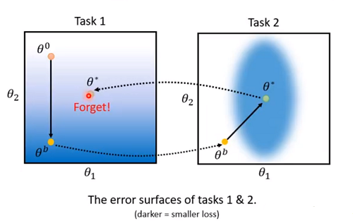
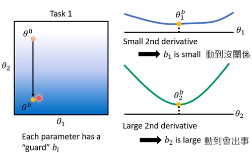
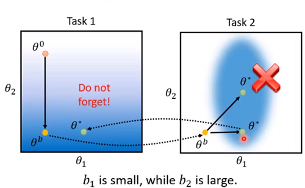
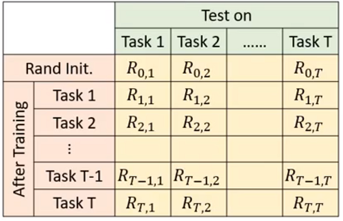
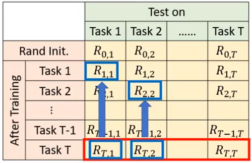
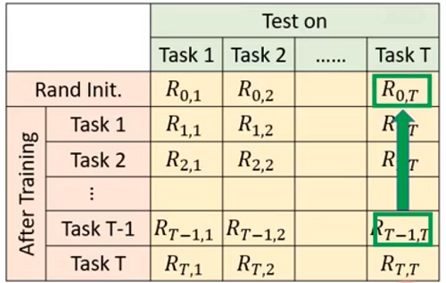

# Hung-yi Lee 学习笔记: Life Long Learning
[学习视频链接](https://www.bilibili.com/video/av48285039/?p=49) (文中例子均来自视频) 
## Knowledge Retention
&emsp;&emsp;在LLL中如果使用很多的任务的数据来训练一个模型的话结果往往是比较好的,但是由于数据量太大,训练这个模型将会十分耗时,下面给出了一种方法来解决问题.
### Elastic Weight Consolidation(EWC)
————弹性权重合并
&emsp;&emsp;基本思想:模型中的一些参数在先前任务中是重要的,这些参数我们就无需或很少在后续训练中改动,而只改动那些不重要的参数. 
&emsp;&emsp;$\theta^{b}$是模型在先前训练中学得的参数. 
&emsp;&emsp;每一个参数$\theta\_{i}^{b}$都有一个"守卫(guard)"$b\_{i}$告诉我们这个参数的重要程度. 
&emsp;&emsp;满足LLL的模型损失函数可以表示成如下形式:
$$L^{'}(\theta)=L(\theta)+\lambda \sum\_{i}b\_{i}(\theta\_{i}-\theta\_{i}^{b})^{2}$$
&emsp;&emsp;其中$L(\theta)$表示当前任务损失,后面一项可以看成是正则化项用以对先前任务中不重要的参数进行大的调节,对先前任务中重要参数进行小的调节或不调节. 
&emsp;&emsp;当$b\_{i}=0$时,就相当于没有任何东西对$\theta\_{i}^{b}$进行保护,这就意味着在当前任务中的$\theta\_{i}$是可以随意改变的. 
&emsp;&emsp;当$b\_{i}=\infty$时,$\theta\_{i}^{b}$被进行了完全保护,这就意味着当前任务中的$\theta\_{i}$必须要和先前任务的参数完全相同. 
&emsp;&emsp;&emsp;&emsp;&emsp;&emsp;&emsp;&emsp;&emsp;&emsp; 
&emsp;&emsp;在使用EWC之前,当我们用任务一学习好的参数作为任务二的初始参数时,任务二在训练完成后的新参数$\theta^{\*}$会不满足任务的最小损失. 
&emsp;&emsp;在观察EWC的效果前,先了解一个定义$b\_{i}$的方法: 
&emsp;&emsp;&emsp;&emsp;&emsp;&emsp;&emsp;&emsp;&emsp;&emsp; 
&emsp;&emsp;我们可以使用$\theta\_{i}^{b}$的二次微分来代表$b\_{i}$.如果二次微分的值很小的话,代表现在的$\theta\_{i}^{b}$落在了一个平缓的地带,则在后续的计算中对其更新也是可以的,反之如果值很大的话则说明落在了一个陡峭的峡谷,此时在更新参数就会导致先前任务的结果变得糟糕,所以还是不动为好. 
&emsp;&emsp;&emsp;&emsp;&emsp;&emsp;&emsp;&emsp;&emsp;&emsp; 
&emsp;&emsp;有了EWC的约束后参数的更新就不会按照原来的方式进行,而是在$\theta\_{1}$方向上较多移动,而$\theta\_{2}$方向上尽量不移动,这样训练出来的参数也就相当于没有忘记之前的任务学习过程.
### Evaluation
&emsp;&emsp;在学习完要进行评估,视频给出一种评估方法: 
&emsp;&emsp;&emsp;&emsp;&emsp;&emsp;&emsp;&emsp;&emsp;&emsp; 
&emsp;&emsp;其中$R\_{i,j}$表示在训练完任务$i$后,模型在任务$j$上表现好坏. 
&emsp;&emsp;如果$i>j$,则表示在训练完任务$i$后,任务$j$是否被遗忘. 
&emsp;&emsp;如果$i<j$,则表示任务$i$学习的知识是否能够transfer到任务$j$上去. 
&emsp;&emsp;利用这个矩阵可以知道模型的准确率:
$$Accuracy = \frac{1}{T}\sum\_{i=1}^{T}R\_{T,i}$$ 
&emsp;&emsp;还可以知道机器多能够记得先前的信息,不过这个值往往是负值: 
&emsp;&emsp;&emsp;&emsp;&emsp;&emsp;&emsp;&emsp;&emsp;&emsp; 
$$Backward\ Transfer = \frac{1}{T-1}\sum\_{i=1}^{T-1}R\_{T,i}-R\_{i,i}$$ 
&emsp;&emsp;还可以知道机器没学到当前任务时,可以学到当前任务的多少: 
&emsp;&emsp;&emsp;&emsp;&emsp;&emsp;&emsp;&emsp;&emsp;&emsp; 
$$Forward\ Transfer = \frac{1}{T-1}\sum\_{i=2}^{T}R\_{i-1,i}-R\_{0,i}$$
