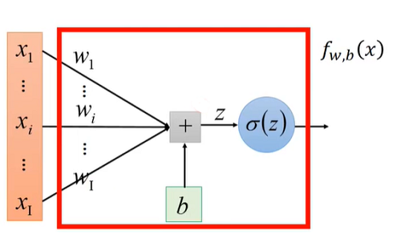
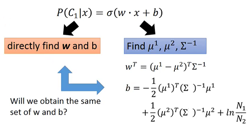
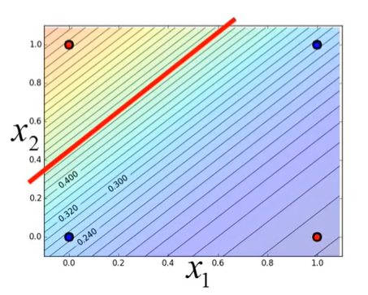
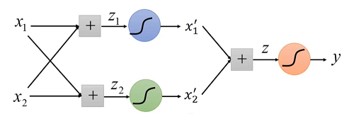

## Hung-yi Lee 学习笔记: Logistic Regression
[学习视频链接](https://www.bilibili.com/video/av48285039/?p=10) (文中例子均来自视频) 
### Step 1: Function Set
&emsp;&emsp;在[Classification](https://github.com/171498290/Hung-yi-Lee-DL-notes/blob/master/classification/classification.md)的(5)式中有$ln\frac{P(x|C_1)}{P(x|C_2)}$,由此可见$P(x|C_1)$实际上是用线性回归模型的预测结果去逼近真实标记得对数几率，因此其对应得模型称为"对数几率回归(逻辑回归)".从后面部分我们知道了$P(C_1|x)=\sigma(z)$,$z=w·x+b=\sum{i}w_ix_i+b$,从而得到了需要的函数表示:$$f_{w,b}(x)=P_{w,b}(C_1|x)$$.下图为计算图表示: 
&emsp;&emsp;&emsp;&emsp;&emsp;&emsp;&emsp;&emsp;&emsp;&emsp;&emsp;&emsp;
### Step 2: Goodness of a Function
| $x^1$  | $x^2$  | $x^3$  | ... ... | $x^N$ |
| ------ | ------ | ------ | ------  | ----- |
| $C^1$  | $C^1$  | $C^2$  | ... ... | $C^1$ |

&emsp;&emsp;现在有一组训练数据,给定一组$w,b$,训练集数据出现的机率可以表示为:
$$L(w,b)=f_{w,b}(x^1)f_{w,b}(x^2)(1-f_{w,b}(x^3))...f_{w,b}(x^N)$$
&emsp;&emsp;最有可能的参数${w}'$和${b}'$是使得$L(w,b)$最大的那一组$w,b$:
$${w}',{b}'=\arg\underset{w,b}{\max}L(w,b)$$
&emsp;&emsp;其等同于:
$${w}',{b}'=\arg\underset{w,b}{\min}-L(w,b)$$
&emsp;&emsp;其中:
$$-lnL(w,b)=-lnf_{w,b}(x^1)-lnf_{w,b}(x^2)-lnf_{w,b}(x^3)...$$
&emsp;&emsp;为了能进行计算,我们需要把$f(x)$的类别表示转换为数字表示,即将$C^n$转换为$\hat{y^n}:$ 当为类别1时取1,为类别2时取0. 

| $x^1$  | $x^2$  | $x^3$  | ... ... |
| ------ | ------ | ------ | ------  |
| $\hat{y^1}=1$ | $\hat{y^2}=1$ | $\hat{y^1}=0$ | ... ... |

&emsp;&emsp;然后我们就可以将$-lnL(w,b)$的每一项写为(其实就是交叉熵):
$$-lnf_{w,b}(x^i)=-[\hat{y^i}inf(x^i)+(1-\hat{y^i})ln(1-f(x^i))]$$
&emsp;&emsp;进而将$-lnL(w,b)$整理为:
$$-lnL(w,b)=\sum_{i}-[\hat{y^i}lnf(x^i)+(1-\hat{y^i})ln(1-f(x^i))]$$
## Step 3: Find the best function
&emsp;&emsp;在Step2后,我们利用梯度下降法可以求出$-lnL(w,b)$的最小值:

$$\frac{\partial{f_{w,b}(x)}}{\partial{w_i}}=\frac{\partial{f_{w,b}(z)}}{\partial{z}}\frac{\partial{z}}{\partial{w_i}}=(1-\sigma(z))x_i$$

$$\frac{\partial{ln(1-f_{w,b}(x))}}{\partial{w_i}}=\frac{\partial{ln(1-f_{w,b}(z))}}{\partial{z}}\frac{\partial{z}}{\partial{w_i}}=\sigma(z)x_i$$

$$\frac{\partial{lnL(w,b)}}{\partial{w_i}}=\sum_{i}-[\hat{y^i}(1-f_{w,b}(x^n))x_{i}^{n}-(1-\hat{y^n})f_{w,b}(x^n)x^{n}_{i}]$$

$$=\sum_{n}-(\hat{y^n}-f_{w,b}(x^n))x^{n}_{i}$$

&emsp;&emsp;经过上述推到后可以得到梯度的更新公式:
$$w_i{\leftarrow}w_i-\eta\sum_{n}-(\hat{y^n}-f_{w,b}(x^n))x_{i}^{n}$$
&emsp;&emsp;上述的梯度更新公式和线性回归的梯度更新公式形式相同,区别在于logistic回归的$\hat{y^n}∈{0,1},f_{w,b}(x)∈[0,1]$,而线性回归的$\hat{y^n}$可以是任何值,$f_{w,b}(x)$是一个实数.
### <u>Logistic Regression + Square Error?</u>
&emsp;&emsp;是否可以使用平方损失函数来进行参数优化呢?答案是否定的,下面给出解释.
&emsp;&emsp;当我们使用平方损失函数进行梯度下降时,其对参数的偏微分为:
$$\frac{\partial{(f_{w,b}(x)-\hat{y^n})^2}}{\partial{w_i}}=2(f_{w,b(x)}-\hat{y^n})f_{w,b(x)}(1-f_{w,b(x)})x_i$$
&emsp;&emsp;当$\hat{y^n}=1$时,如果$f_{w,b}(x^n)=1$(接近目标值),那么可以得到$\frac{\partial{L}}{\partial{w_i}}=0$,这个结果是合乎情理的. 
&emsp;&emsp;但是当$\hat{y^n}=1$,而$f_{w,b}(x^n)=0$(远离目标值)时,$\frac{\partial{L}}{\partial{w_i}}=0$,此时我们还在远离极小值点的地方寻求下降梯度,此时下降的速度应该是比较快的,但是由于预测值接近0,从而使得梯度下降地十分缓慢,训练时间变得很长.
## Discriminative v.s. Generative
&emsp;&emsp;&emsp;&emsp;&emsp;&emsp;&emsp;&emsp;&emsp;&emsp;&emsp;&emsp; 
&emsp;&emsp;上图左边为判别式(Discriminative)模型,右边为生成式(Generative)模型,由于生成式模型在构建时对$x$的分布进行假设(Gaussian distribution等),而判别式模型模型则未作出任何假设,直接由给定数据集进行模型训练.这样就使得他们虽然有相同的模型,但是训练得到的模型参数确实不同的.一般来说,判别式模型是优于生成式模型的.但在模型情况下生成式模型也是存在一定优势的.

+ 生成式模型的优点
   + 在假设$x$的概率分布的条件下,所需的训练数据更少
   + 在假设$x$的概率分布的条件下,对噪声数据具有更强的鲁棒性
   + 先验概率$P(C_i)$和某一类别下的后验概率$P(x|C_i)$可以来自不同的源(如语音辨识中某一个字出现的概率可以简单的从文本中获取)
## Limitation of Logistic Regression
&emsp;&emsp;对数几率回归也存在局限性,举个简单的例子,当输入的值如下表所示时分类就会出现问题:

| $X_1$  | $X_2$  | Label  |
| ------ | ------ | ------ |
| 0  | 0  | Class 2  |
| 0  | 1  | Class 1  |
| 1  | 0  | Class 1  |
| 1  | 1  | Class 2  |

&emsp;&emsp;&emsp;&emsp;&emsp;&emsp;&emsp;&emsp;&emsp;&emsp;&emsp;&emsp; 
&emsp;&emsp;由于对数几率回归的分割边界就是一条直线,所以我们没有办法给出正确的划分. 
&emsp;&emsp;对于这种问题,我们可以进行特征转换(Feature Transformation),即将输入值的每个特征做适当变换,使得我们可以对新的输入数据进行有效划分. 
&emsp;&emsp;视频中给出的一个转换方式是求出当前点与某一点的距离作为当前点某一特征的值,对有$n$个特征的输入而言,需要找到$n$个距离计算点.举例来说,对向量$\vec{x}=[1, 1]$进行转换,距离计算点分别为$\vec{d_1}=[0, 0],\vec{d_2}=[1, 1]$,则转换后的{x}_{1}'=\sqrt{(1-0)^2+(1-0)^2}=\sqrt2$,${x}_{2}'=\sqrt{(0-0)^2+(0-0)^2}=0$,最终得到${x}'=[\sqrt2, 1]$.但是寻找距离计算点是一个比较困难的问题,那么就需要新的解决方法. 
&emsp;&emsp;我们可以通过堆叠多个对数几率回归来解决问题: 
&emsp;&emsp;&emsp;&emsp;&emsp;&emsp;&emsp;&emsp;&emsp;&emsp;&emsp;&emsp; 
&emsp;&emsp;如图所示,我们可以给输入的特征分量以不同的参数,来获得符合我们预期的转换后的新的特征分量.这样堆叠的每个对数几率回归节点可以称为"神经",堆叠后的整体模型称为"神经网络". 