# Hung-yi Lee 学习笔记: Recurrent Neural Network(Part Ⅰ) 
[学习视频链接](https://www.bilibili.com/video/av48285039/?p=43) (文中例子均来自视频) 
## RNN Structure
&emsp;&emsp;隐藏层的输出保存在内存(Memory)当中. 
&emsp;&emsp;内存可以被看成是另外一个输入. 
&emsp;&emsp;&emsp;&emsp;&emsp;&emsp;&emsp;&emsp;&emsp;&emsp;&emsp;&emsp;&emsp;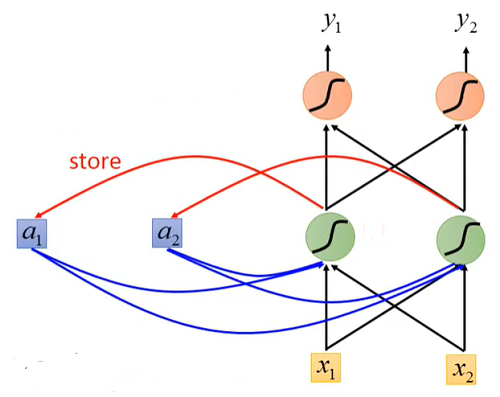 
## Example
&emsp;&emsp;给出三个输入序列$[1,1], [1,1], [2,2]$,且令网络中的所有权重(weights)都是1,不设置偏置值(bias).所有的激活函数都是线性函数.初始时内存中不存储数据,为0. 
&emsp;&emsp;&emsp;&emsp;&emsp;&emsp;&emsp;&emsp;&emsp;&emsp;&emsp;&emsp;&emsp; 
&emsp;&emsp;将$[1,1]$输入网络,得到输出$[4,4]$,此时更新内存中的值,更新后为$[2,2]$.然后输入数据$[1,1]$.此时第一个隐藏层值得计算还要额外加上存储在内存中的值,即$1×1+1×1+2=6$.然后将6存入内存中进行下一次循环. 
&emsp;&emsp;&emsp;&emsp;&emsp;&emsp;&emsp;&emsp;&emsp;&emsp;&emsp;&emsp;&emsp;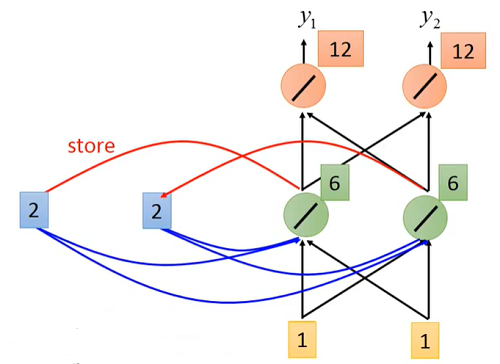 
&emsp;&emsp;容易发现当输入数据的序列发生变化时得到的输出结果是不同的,所以说RNN是考虑了输入数据的顺序的. 
&emsp;&emsp;当然RNN的结构也是可以任意堆叠的,根据不同的问题设置可以进行不同的设计. 
&emsp;&emsp;&emsp;&emsp;&emsp;&emsp;&emsp;&emsp;&emsp;&emsp;&emsp;&emsp;&emsp;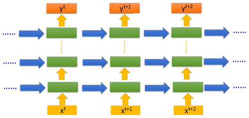 
## Elman Network & Jordan Network
&emsp;&emsp;Elman网络在内存中存储的是**隐藏层**的输出.当前隐藏曾的输出依赖于输入和上一个时间段的隐藏层的输出: 
&emsp;&emsp;&emsp;&emsp;&emsp;&emsp;&emsp;&emsp;&emsp;&emsp;&emsp;&emsp;&emsp;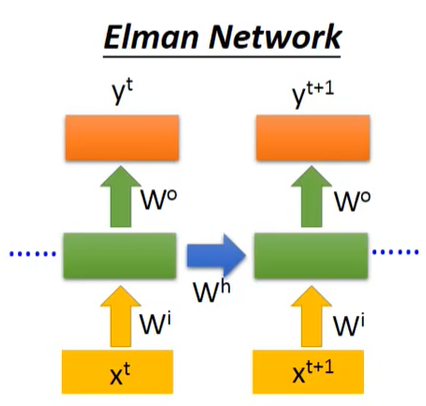 
&emsp;&emsp;Jordan网络在内存中存储的是**整个网络的输出**.当前隐藏层的输出依赖于上一个时间段的输出层的输出: 
&emsp;&emsp;&emsp;&emsp;&emsp;&emsp;&emsp;&emsp;&emsp;&emsp;&emsp;&emsp;&emsp;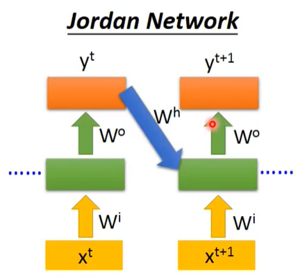 
## Bidirectional RNN(biRNN)
&emsp;&emsp;biRNN在内存中同时存储了序列正向输入时产生的值和负向输入时产生的值,然后将他们一起传递给网络的输出层.这样的设计不仅可以考虑到当前时刻的前一个时刻的状态,还可以考虑到当前时刻后一个时刻的状态. 
&emsp;&emsp;&emsp;&emsp;&emsp;&emsp;&emsp;&emsp;&emsp;&emsp;&emsp;&emsp;&emsp;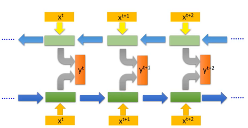 
## Long Short-term Memory(LSTM)
&emsp;&emsp;LSTM中的内存不是随意可以被更新和输出的,它必须要满足一些条件: 
+ 输入门(Input Gate): 控制外界数据是否可以进入到LSTM中
+ 遗忘门(Forget Gate): 控制当前内存值是否可以加入到下一个时间序列中
+ 输出门(Output Gate): 控制数据是否可以从LSTM输出 
&emsp;&emsp;&emsp;&emsp;&emsp;&emsp;&emsp;&emsp;&emsp;&emsp;&emsp;&emsp;&emsp;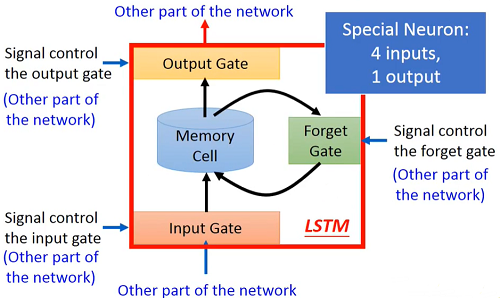 
&emsp;&emsp;下图是更为具体的图形表示.首先介绍各个符号的含义.$z$为LSTM块的输入,$z\_{i}$为控制输入门开关的值,$z\_{f}$为控制遗忘门开关的值,$z\_{o}$为控制输出门开关的值,$c$为当前内存中的值. 
&emsp;&emsp;激活函数$f$一般选用为sigmoid函数.因为sigmoid函数会将输入值映射到区间$[0,1]$之间,这样做恰好可以表示为阈值门打开程度的一个表示.例如当$f(z\_{i}=1)$时就表示输入门完全打开,此时$g(z)f(z\_{i})=g(z)$,外界的输入就完全被接受;输入门打开.当$f(z\_{i}=0.5)$时就表示输入门部分打开,此时$g(z)f(z\_{i})=0.5g(z)$,外界输入被部分接受;当$f(z\_{i}=1)$时,$g(z)f(z\_{i})=0$,输入门紧闭,外界输入只能悻悻而归. 
&emsp;&emsp;其他阈值门也是相似的理解方法,不过要注意遗忘门并不是其输出为1时就表示完全遗忘,其表示的是完全记忆,为0时才表示完全遗忘. 
&emsp;&emsp;对整个过程进行梳理: 
   + 判断对$g(z)$输入的接受程度$g(z)f(z\_{i})$;
   + 根据遗忘成都对当前内存进行更新:
$$c^{'}=g(z)f(z\_{i})+cf(z\_{f})$$
   + 判断对$h(c^{'})$输出的接受程度$h(c^{'})f(z\_{o})$ 
&emsp;&emsp;&emsp;&emsp;&emsp;&emsp;&emsp;&emsp;&emsp;&emsp;&emsp;&emsp;&emsp;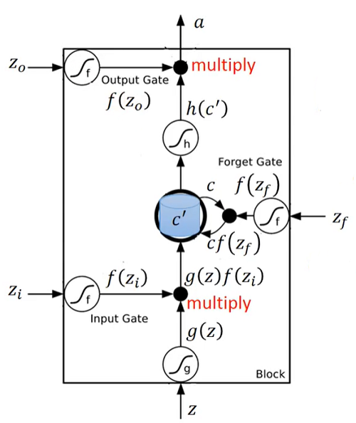 
## LSTM - Example
&emsp;&emsp;视频中给出了一个LSTM计算的具体例子:初始化内存为0,函数$h,g$为线性函数,输入参数和每个阈值门的参数已经学习完成,输入为3维向量,输出为1维向量. 
&emsp;&emsp;&emsp;&emsp;&emsp;&emsp;&emsp;&emsp;&emsp;&emsp;&emsp;&emsp;&emsp;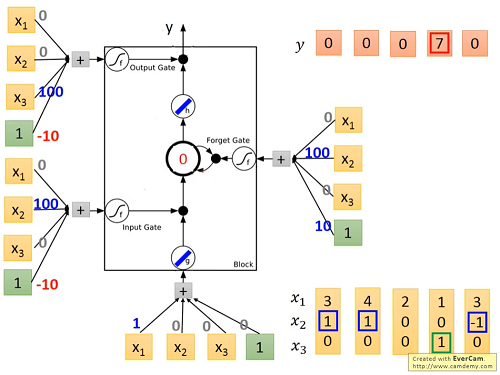 
&emsp;&emsp;输入数据$[3,1,0]$,运算过程如图所示: 
&emsp;&emsp;&emsp;&emsp;&emsp;&emsp;&emsp;&emsp;&emsp;&emsp;&emsp;&emsp;&emsp;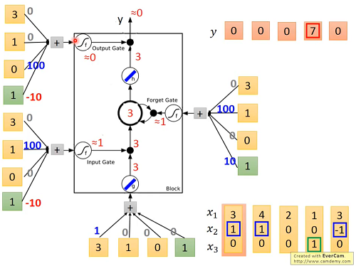 
&emsp;&emsp;后续计算同理. 
&emsp;&emsp;一个LSTM可以理解为1个特殊的神经元,由于这个神经元的输入和三个阈值门都是需要通过参数来操作的,所以连接有LSTM的神经网络会比一般的神经网络多4倍的参数. 
&emsp;&emsp;&emsp;&emsp;&emsp;&emsp;&emsp;&emsp;&emsp;&emsp;&emsp;&emsp;&emsp;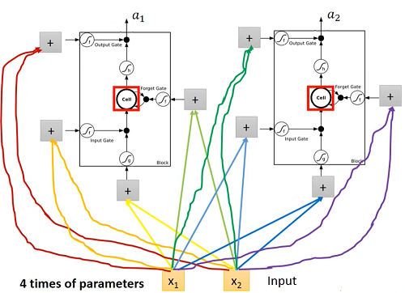 
## Learning Target
&emsp;&emsp;搭建好了网络后就要考虑如何进行其中的参数优化,举视频中的例子,如下图: 
&emsp;&emsp;&emsp;&emsp;&emsp;&emsp;&emsp;&emsp;&emsp;&emsp;&emsp;&emsp;&emsp;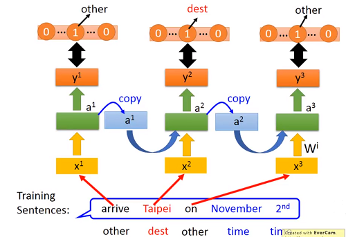 
&emsp;&emsp;例如在做实体识别时,"arrive"的正确标记是"other",则对应的正确的输出标签则是一个在"other"位置为1,其余位置为0的n维one-hot向量,"Taipei"的正确标记是"dest",则对应的正确的输出标签则是一个在"dest"位置为1,其余位置为0的n维one-hot向量,其中n表示标记的数量.优化的目标就是使得训练得到的$\hat y^{i}$和实际的$y^{i}$越接近越好,此时可以使用交叉熵损失函数进行参数优化.
## Learning
&emsp;&emsp;RNN的训练是通过时间序列上的反向传播(Backpropagation through time)进行的. 
### The error surface is rough
&emsp;&emsp;虽然RNN拥有良好的时间序列上的性质,但是它并不是容易被训练的.一些情况下,其训练的损失并不是逐步下降,而是不断地上下波动的: 
&emsp;&emsp;&emsp;&emsp;&emsp;&emsp;&emsp;&emsp;&emsp;&emsp;&emsp;&emsp;&emsp;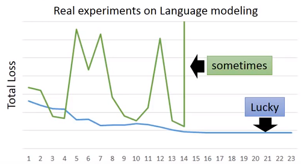 
&emsp;&emsp;这是由于RNN的损失函数表面是高低不平的,它可能和陡峭也可能和平坦.使用梯度下降时,万一更新的下一个点恰好跳到另外一个高台时,损失又会急剧变大: 
&emsp;&emsp;&emsp;&emsp;&emsp;&emsp;&emsp;&emsp;&emsp;&emsp;&emsp;&emsp;&emsp;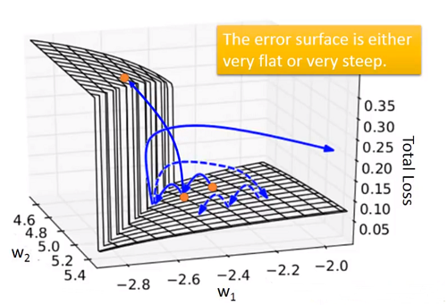 
&emsp;&emsp;那为什么RNN会有如此奇怪的特性的,视频中给出一个直观的例子: 
&emsp;&emsp;&emsp;&emsp;&emsp;&emsp;&emsp;&emsp;&emsp;&emsp;&emsp;&emsp;&emsp;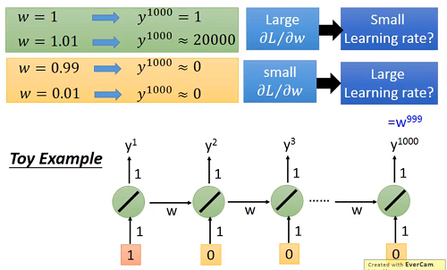 
&emsp;&emsp;例中给出一个由线性激活函数构成的RNN,其中参数$w$以乘积形式作用于下一个时间步,输入数据中只有第一个时间步为1,其余均为0,而$y^{1000}=w^{999}$ 
&emsp;&emsp;当$w=1$时,$y^{1000}=1$,而当$w$增加一个很小的值$\Delta w=0.01$到1.01时,$y^{1000}\approx 20000$,$w$减少一个很小的值$\Delta w=0.01$到0.99时,$y^{1000}\approx 0$. 
&emsp;&emsp;由此可见在RNN中由于一个参数被共用多次导致在多次迭代后梯度的值会很大或很小,这样在设置学习率时就尤为麻烦,而训练的损失也时好时坏.
### Helpful Techniques
+ LSTM
   + 可以避免梯度消失(非梯度爆炸)
      + 内存和输入值是**相加**的
      + 除非遗忘门关闭,否则之前的影响不会消失