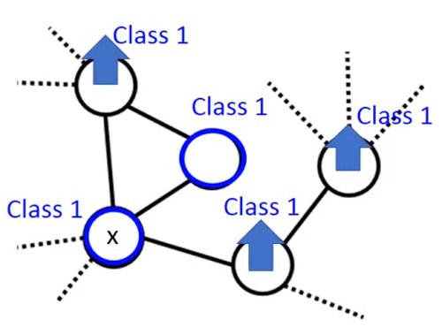

# Hung-yi Lee 学习笔记: Semi-supervised Learning
[学习视频链接](https://www.bilibili.com/video/av48285039?p=47) (文中例子均来自视频) 
## Introduction
+ 有监督学习: $[(x^{r},\hat y^{r})]\_{r=1}^{R}$
   + E.g.$\ x^{r}$:图片数据,$\hat y^{r}$:图片所属类别
+ 半监督学习: $[(x^{r},\hat y^{r})]\_{r=1}^{R}, [{x^{u}]\_{u=R}^{R+U}$
   + 在半监督学习中,有大量的无标签数据,而这些无标签数据的数量一般是远远大于有标签数量的$U\gg R$.
   + 一种半监督学习方法被称为传导学习(Transductive learning):无标签数据作为测试数据
   + 另一种半监督学习方法被称为归纳学习(Inductive learning):无标签数据不作为测试数据

## Semi-supervised Learning for Generative Model
+ 在生成式模型中,给定有标签的训练数据$x^{r}∈C\_{1},C\_{2}$
   + 目的是寻找最可能的$P(C\_{i})$和$P(x|C\_{i})$
   + 假设$P(x|C\_{i})$是含有参数$\mu^{i},\sum$的高斯分布 

&emsp;&emsp;&emsp;&emsp;&emsp;&emsp;&emsp;&emsp;&emsp;&emsp;&emsp;&emsp; 
&emsp;&emsp;有了这些数据后就可以计算出$P(C\_{i}|x)$的值.但如果现在有一些不含标签的数据,这些数据就会影响我们的决定.具体而言,我们做出的高斯分布假设中的参数会发生改变,其分布形状和原先大不相同,决策边界就会发生变化. 
&emsp;&emsp;&emsp;&emsp;&emsp;&emsp;&emsp;&emsp;&emsp;&emsp;&emsp;&emsp; 
### Semi-supervised Generative Model
+ 初始化:$\theta=[P(C\_{1}),P(C\_{2}),\mu^{1},\mu^{2},\sum]$
+ 第一步:根据模型计算$P(C\_{1}|x^{u})$
+ 第二步:更新模型
$$P(C\_{1}=\frac{N\_{1}+\sum\_{x^{u}}P(C\_{1}|x^{u})}{N})$$
   + $N$: 所有数据的数量
   + $N\_{1}$:所有数据中属于$C\_{1}$的数据数量
$$\mu^{1}=\frac{1}{N\_{1}}\sum\_{x^{r}\in C\_{1}}x^{r}+\frac{1}{\sum\_{x^{u}}P(C\_1|x^{u})}\sum\_{x^{u}}P(C\_{1}|x^{u})x^{u}$$
+ 返回第一步再进行迭代,直到收敛 

&emsp;&emsp;为什么要这么做呢,视频中给出了解释:
+ 只考虑有标签的学习中,我们的目的是最大化当前样本出现的概率:
$$logL(\theta)=\sum\_{x^{r}}logP\_{\theta}(x^{r},\hat y^{r})$$
+ 而在含有无标签数据的学习中,我们的最大化目标变为了:
$$logL(\theta)=\sum\_{x^{r}}logP\_{\theta}(x^{r},\hat y^{r})+\sum\_{x^{u}}logP\_{\theta}(x^{u})$$
   + 由于目标函数非凸,所以就只能像前面所述的方法迭代的解决问题
   + 因为$x{u}$可以属于$C\_{1}$也可以来自$C\_{2}$,所以其概率为:
$$P\_{\theta}(x^{u})=P\_{\theta}(x^{u}|C\_{1})P\_(C\_{1})+P\_{\theta}(x^{u}|C\_{2})P\_(C\_{2})$$

## Low-density Separation
--**"非黑即白"**
### Self-training
+ 给定有标签数据集$[(x^{r},\hat y^{r})]\_{r=1}^{R}$,无标签数据集$[x^{u}]\_{u=l}^{R+U}$
+ 重复：
   + 使用有标签数据训练模型$f^{\*}$
   + s使用$f^{\*}$给无标签数据打标签(Pseudo-label):$[x^{u},y^{u}]\_{u=l}^{R+U}$$
   + 将无标签数据中的部分数据移除,而后添加到原始的有标签数据集合中

#### Entropy-based Regularization
&emsp;&emsp;在low-density separation中表现出的是一种"非黑即白"的思想,不像半监督的生成式模型会给出数据属于哪一类的概率,low-density separation看到数据属于某一类的概率最大则直接将其划分到某一类之中.但这样的做法在多分类的问题中可能过于武断,如果每一个类出现的概率大致相同就难以直接划分.为此可以使用基于交叉熵的正则化.
&emsp;&emsp;交叉熵:
$$E(y^{u})=-\sum\_{m=1}^{5}y\_{m}^{u}ln(y\_{m}^{u})$$
&emsp;&emsp;&emsp;&emsp;&emsp;&emsp;&emsp;&emsp;&emsp;&emsp;&emsp;&emsp; 
&emsp;&emsp;越低的熵表明$y^{u}$的分布越集中,那么我们可以给出一个损失函数的表达:
$$L=\sum\_{x^{r}}C(y^{r},\hat y^{r})+\lambda \sum\_{x^{u}}E(y^{u})$$
&emsp;&emsp;式中前半部分是有标签数据的损失,后面的正则化项时无标签数据的损失.
## Smoothness Assumption
--**"近朱者赤,近墨者黑"**
+ 简单假设: "相似"的$x$具有同样的$\hat y^{u}$
+ 更精确的:
   + $x$不是均匀分布
   + 如果$x^{1}$和$x^{2}$连接的路径上数据的分布密集的话,则对应的$\hat y^{1}$和$\hat y^{2}$也是相似的.
&emsp;&emsp;&emsp;&emsp;&emsp;&emsp;&emsp;&emsp;&emsp;&emsp;&emsp;&emsp; 
&emsp;&emsp;在上图中,如果根据简单假设判断的话,$x^{2}$和$x^{3}$的距离最接近,他们最"相似",应该分为一类.但是从图中可以看到实际上$x^{2}$和$x^{3}$是不属于同一类的,$x^{1}$和$x^{2}$才是属于同一类的.
&emsp;&emsp;若按照精确假设来说,$x^{2}$通往$x^{1}$的路径上数据的分布更稠密,而$x^{2}$通往$x^{3} $的路径上数据的分布更稀疏,那么我们就有理由相信$x^{1}$和$x^{2}$属于同一类.
&emsp;&emsp;&emsp;&emsp;&emsp;&emsp;&emsp;&emsp;&emsp;&emsp;&emsp;&emsp; 
### Graph-based Approach
&emsp;&emsp;将数据点表示成图,相连的点是可以计算距离的,不相邻的点无论看起来多近都不能计算距离.
&emsp;&emsp;&emsp;&emsp;&emsp;&emsp;&emsp;&emsp;&emsp;&emsp;&emsp;&emsp; 
#### Graph Construction
+ 定义$x^{i}$和$x^{j}$距离计算方法$s(x^{i},x^{j})$
+ 添加边(edge):
   + K临近距离(k Nearest Neighbor):将当前点与其他点的距离中最接近的k个点相连
&emsp;&emsp;&emsp;&emsp;&emsp;&emsp;&emsp;&emsp;&emsp;&emsp;&emsp;&emsp; 
   + $e$临近(e-Neighborhood):与当前点相似度超过某一个阈值的点会被连接起来
&emsp;&emsp;&emsp;&emsp;&emsp;&emsp;&emsp;&emsp;&emsp;&emsp;&emsp;&emsp; 
+ 给边增加权重,权重正比于距离
   + 使用高斯径向函数(Gaussian Radial Basis Function):
$$s(x^{i},x^{j})=exp(-\gamma {||x^{i}-x^{j}||}^{2})$$

&emsp;&emsp;在图中与有标记点相连的数据点属于相连数据的标记的可能性就越大,而这种可能性是会传递的,只要点之间有连接,这种传递就会持续下去. 
&emsp;&emsp;&emsp;&emsp;&emsp;&emsp;&emsp;&emsp;&emsp;&emsp;&emsp;&emsp; 
&emsp;&emsp;如下图所示,与蓝色点和红色点直接或间接相邻的点最终都被传递成相应的所属类别了. 
&emsp;&emsp;emsp;&emsp;&emsp;&emsp;&emsp;&emsp;&emsp;&emsp;&emsp;&emsp; 
&emsp;&emsp;通过上述定性表述了解大致思路后,接下来进行定量分析
+ 定义图中标签的平滑度(smoothness):
$$S=\frac{1}{2}\sum\_{i,j}w\_{i,j}(y^{i}y^{j})^2$$
   + $i,j$表示的是相互直接连接的点
   + $w\_{i,j}$是相邻点边的权重
   + 无论是有标签数据还是无标签数据都要被计算在内 

&emsp;&emsp;emsp;&emsp;&emsp;&emsp;&emsp;&emsp;&emsp;&emsp;&emsp;&emsp; 
&emsp;&emsp;上述的平滑度计算公式可以一矩阵的方式来重写:
$$S=\frac{1}{2}\sum\_{i,j}w\_{i,j}(y^{i}y^{j})^2=\mathbf{y^{T}}L\mathbf{y}$$
&emsp;&emsp;其中$\mathbf{y}$是一个$(R+U)$维的向量:
$$\mathbf{y}=[\cdots y^{i}\cdots y^{j}\cdots]^{T}$$
&emsp;&emsp;$L$是一个$(R+U)×(R+U)$的矩阵:
$$L=D-W$$
$$W=
\begin{bmatrix}
 0&  2&  3& 0\\ 
 2&  0&  1& 0\\ 
 3&  1&  1& 0\\ 
 0&  0&  1& 0
\end{bmatrix}
$$

$$D=
\begin{bmatrix}
 5&  0&  0& 0\\ 
 0&  3&  0& 0\\ 
 0&  0&  5& 0\\ 
 0&  0&  0& 1
\end{bmatrix}
$$
&emsp;&emsp;在训练神经网络时的损失函数表达为:
$$L=\sum\_{x^{r}}C({y^{r},\hat {y^{r})+\lambda S$$