# Hung-yi Lee 学习笔记: Life Long Learning
[学习视频链接](https://www.bilibili.com/video/av48285039/?p=56) (文中例子均来自视频) 
## Review of RNN
### RNN with Gated Mechanism
$$h^{'},y = f(h,y)$$ 
&emsp;&emsp;&emsp;&emsp;&emsp;&emsp;&emsp;&emsp;&emsp;&emsp;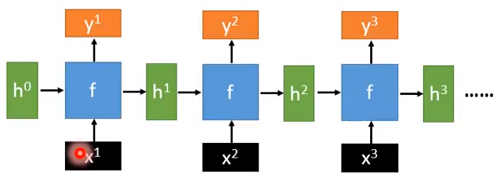 
### Deep RNN
$$h^{'},y = f\_{1}(h,y),b^{'},c = f\_{2}(b,y)$$ 
&emsp;&emsp;&emsp;&emsp;&emsp;&emsp;&emsp;&emsp;&emsp;&emsp;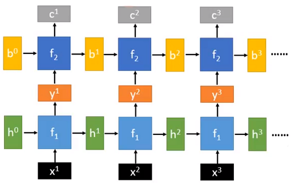 
### Naive RNN
$$h^{'},y = f(h,y)$$ 
&emsp;&emsp;&emsp;&emsp;&emsp;&emsp;&emsp;&emsp;&emsp;&emsp;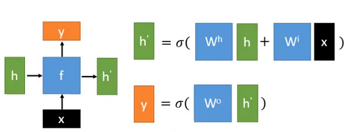 
### LSTM
+ $c$变化的比较慢:$c^{t}$是$c^{t-1}$加上其他信息得到的
+ $h$变化的比较快:$h^{t}$和$h^{t-1}$可能会非常不同 
&emsp;&emsp;&emsp;&emsp;&emsp;&emsp;&emsp;&emsp;&emsp;&emsp;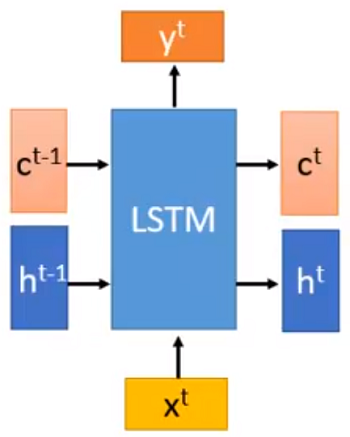 
&emsp;&emsp;一般将$x^{t}$和$h^{t-1}$向量连接在一起乘以不同的参数得到不同的输出(不同的控制门): 
&emsp;&emsp;&emsp;&emsp;&emsp;&emsp;&emsp;&emsp;&emsp;&emsp;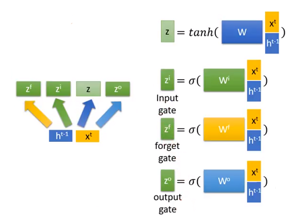 
$$c^{t}=z^{f}\odot c^{t-1}+z^{i}\odot z$$
$$h^{t}=z^{o}\odot tanh(c^{t})$$
$$y^{t}=\sigma (W^{'}h^{t})$$ 
&emsp;&emsp;&emsp;&emsp;&emsp;&emsp;&emsp;&emsp;&emsp;&emsp;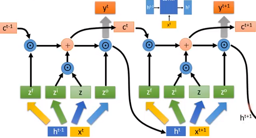 
### GRU
$h^{t}=z\odot h^{t-1}+(1-z)\odot h^{'}$ 
&emsp;&emsp;&emsp;&emsp;&emsp;&emsp;&emsp;&emsp;&emsp;&emsp;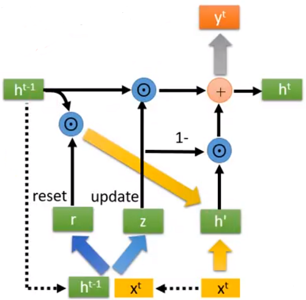 
## Sequence Generation
+ 句子都是由单词/字构成的
+ 让RNN在每个时间点产生一个单词/字 

&emsp;&emsp;&emsp;&emsp;&emsp;&emsp;&emsp;&emsp;&emsp;&emsp;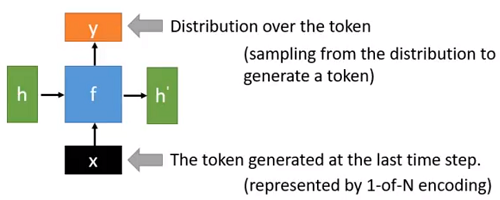 
&emsp;&emsp;$x$是上一个时间步产生的词向量(此处为one-hot向量),$y$是这些词的一个分布,下一个时间步的$x$是在$y$的分布中进行采样得到的. 
&emsp;&emsp;&emsp;&emsp;&emsp;&emsp;&emsp;&emsp;&emsp;&emsp;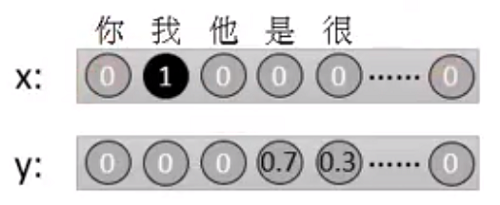 
&emsp;&emsp;注意是采样(sample)而非直接将出现概率最大(argmax)的词输出.即有70%的概率会在下一个时间步输出序列"我是",有30%的概率会在下一个时间步输出序列"我很". 
&emsp;&emsp;在第一个时间步上需要一个特殊的开始标志使得我们输出的第一个词是随机的,这样的话就可以让机器每次自己开始而不用人为输入第一个词了.不过人为输入第一个词也可以. 
&emsp;&emsp;还需要一个终止标志,否则句子就会无止尽的输出下去. 
&emsp;&emsp;&emsp;&emsp;&emsp;&emsp;&emsp;&emsp;&emsp;&emsp;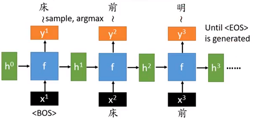 
## Conditional Sequence Generation
### Conditional Generation
+ 我们不想简单的产生一些随机的句子
+ 想要使得产生的句子是依赖于特定情境的

+ **将输入情景表示成为一个向量,并考虑将这个向量作为RNN生成器的输入**
#### Image Caption Generation
&emsp;&emsp;&emsp;&emsp;&emsp;&emsp;&emsp;&emsp;&emsp;&emsp;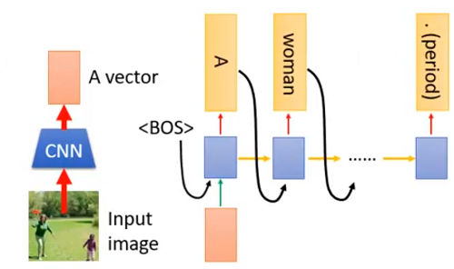 
&emsp;&emsp;在图片标题生成中首相将输入的图片通过CNN转化成为一个向量,然后将这个向量加入到第一个时间步(通常是将这个向量加入到每个时间步上防止序列过长把这个信息忘记).在训练时将预测标题与真实的标题做交叉熵求损失得到参数.
#### Machine translation
&emsp;&emsp;&emsp;&emsp;&emsp;&emsp;&emsp;&emsp;&emsp;&emsp;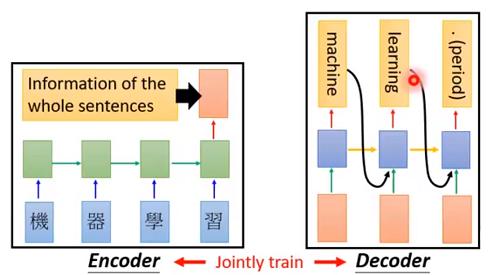 
&emsp;&emsp;机器翻译的编码部分是将原始句子的所有信息压缩在最后一个时间步输出,在解码部分将压缩的所有信息加入到每一个时间步得到翻译结果.
### Dynamic Conditional Generation
#### Machine Translation
&emsp;&emsp;在机器翻译的编码部分由于序列长短不同可能最后输出的信息不能代表整个句子,这样的信息丢失就使得在随后的解码过程中会出现问题. 
&emsp;&emsp;现在我们将每个时间步的向量$h^{t}$都存起来到一个"数据库"中,然后在解码时,在每次要产生新词汇时都会去数据库中寻找它要的信息生成某一个词汇.之所以叫动态的条件生成就是因为每个时间步的解码过程都是在随时调整输入的. 
&emsp;&emsp;&emsp;&emsp;&emsp;&emsp;&emsp;&emsp;&emsp;&emsp;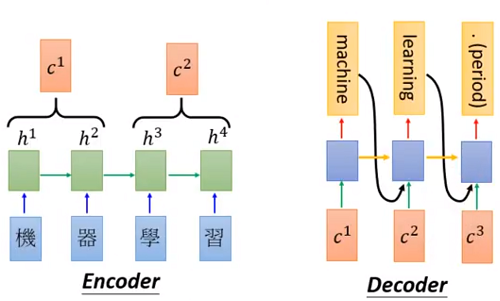 
+ Attention-based model 
&emsp;&emsp;解码部分会计算出每一个时间步产生的向量$h^{t}$.$z^{0}$是"搜寻数据库的关键字(key)".它的搜寻方法是让$z^{0}$与$h^{t}$计算获取匹配程度,$\alpha$就是匹配得分.这个key是也是一个参数,在初始时也是需要学习的. 
&emsp;&emsp;&emsp;&emsp;&emsp;&emsp;&emsp;&emsp;&emsp;&emsp;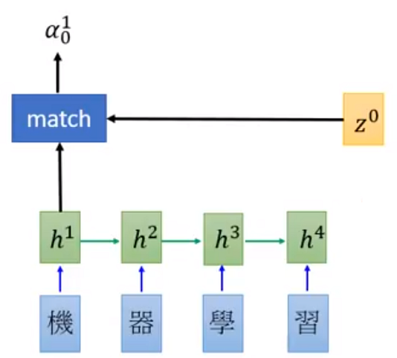 

&emsp;&emsp;什么是**match**呢?这是取决于我们自己的:
    + $z$和$h$的余弦相似度
    + 一个小的神经网络,输入是$z$,输出是$h$
    + $\alpha=h^{T}Wz$ 

&emsp;&emsp;需要强调的是如果match中有参数,它的参数不需要单独学习而是和整个的模型一起学习出来的. 
&emsp;&emsp;对每个$h^{t}$计算匹配得分$\alpha$,然后通过softmax映射成和为1的$\hat \alpha$(sofmax可做可不做,看个人喜好),再将每个时间步$\hat \alpha$与$h$相乘求和得到解码器中的第一个输入$c^{0}$. 
&emsp;&emsp;&emsp;&emsp;&emsp;&emsp;&emsp;&emsp;&emsp;&emsp;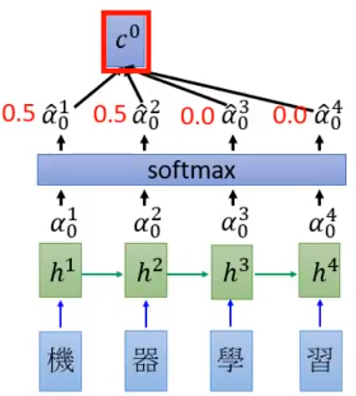 
&emsp;&emsp;图中$c^{0}$的计算结果就是:
$$c^{0}=\sum \hat{\alpha\_{0}^{i}}h^{i}$$
$$=0.5h^{1}+0.5h^{2}$$ 
&emsp;&emsp;&emsp;&emsp;&emsp;&emsp;&emsp;&emsp;&emsp;&emsp;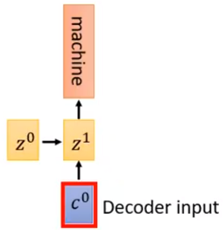 
&emsp;&emsp;在第一个时间步骤的解码过程中,将$z^{0}$和$c^{0}$作为输入生成一个翻译后的词语,同时输出$z^{1}$,再将$z^{1}$和$h^{t}$做匹配计算获得$c^{1}$,然后使用$z^{1}$和$c^{1}$加上上一个时间步输出的词汇作为输入输出当前时间步的词汇和新的$z^{2}$...依次往复,直到出现结束标志. 
&emsp;&emsp;&emsp;&emsp;&emsp;&emsp;&emsp;&emsp;&emsp;&emsp;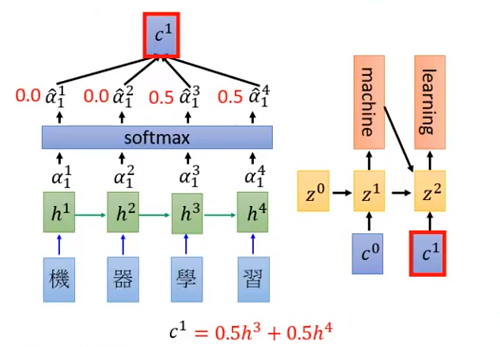 
## Tips for Generation
### Attention
&emsp;&emsp;在注意力模型中解码器(Decoder)每一个时间步的输出由注意力得分控制,如果这些得分出现问题,那对于解码输出来说也是不好的. 
&emsp;&emsp;&emsp;&emsp;&emsp;&emsp;&emsp;&emsp;&emsp;&emsp;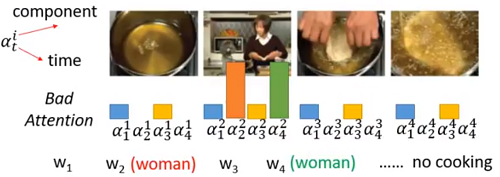 
&emsp;&emsp;上图中$\alpha\_{t}{i}$代表在解码器的第t个时间步上的解码器上第i个时间步的注意力得分.从上图可以看到在解码器的第二和第四个时间步上,第二章图片的注意力都很高,这样的注意力就可能导致输出的第二个词汇和第四个词汇都是woman. 
&emsp;&emsp;较好的注意力则是每次输入的各个注意力得分大约都有相同的权重:
$$E.g Regularization term:\sum\_{i}(=\sum\_{t}\tau - \alpha\_{t}{i})^{2}$$ 
### Mismatch between Train and Test
&emsp;&emsp;序列模型在训练时下一个时间步的输入中是前一个时间步的正确序列的输出,即在训练时的数据是由参考的. 
&emsp;&emsp;&emsp;&emsp;&emsp;&emsp;&emsp;&emsp;&emsp;&emsp;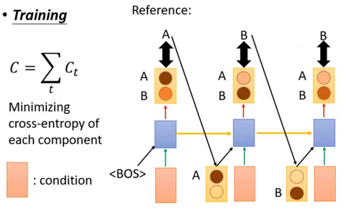 
&emsp;&emsp;而在测试时下一个时间步的输入是上一个时间步的预测输出. 
&emsp;&emsp;&emsp;&emsp;&emsp;&emsp;&emsp;&emsp;&emsp;&emsp;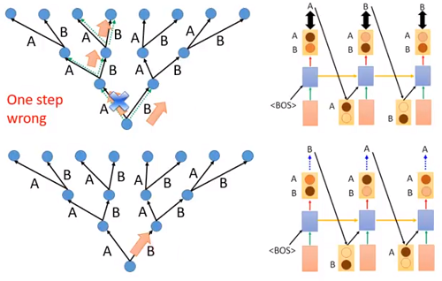 
&emsp;&emsp;假设现在模型只能生成两个词汇A,B.在训练时都是由正确输出来做参考的,所以即使是第一步走错,后面也会被纠正回来的.而在测试时没有参考的情况下每一个分支都是可以进行尝试的,而这些尝试中就存在训练时没有出现的情况,就会出现一步错,步步错的情况. 
&emsp;&emsp;一种方法是在训练时将当前时间步的预测输出加入到下一个时间步的输入当中,这样就会产生多种分支,减少不匹配问题.但这种方法在实际操作中很难训练到一个好的结果.
#### Scheduled Sampling
&emsp;&emsp;给机器看正确的答案,就会让训练和测试不一致,给机器看其自己生成的东西,结果又做不好,那不如来一个折衷做法.在训练时下一个时间步的输入用正确值还是预测值是由抛硬币来决定的.与此同时,抛硬币正反面的几率是动态调整的. 
&emsp;&emsp;&emsp;&emsp;&emsp;&emsp;&emsp;&emsp;&emsp;&emsp;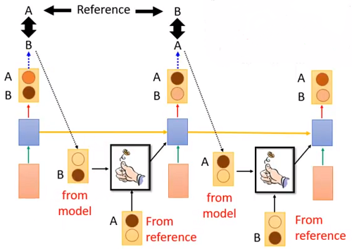 