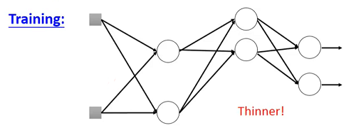

# Hung-yi Lee 学习笔记: Tips for Deep Learning
[学习视频链接](https://www.bilibili.com/video/av48285039?p=32) (文中例子均来自视频) 
## Recipe(诀窍) of Deep Learning
+ Step 1 : Define a set of function
+ Step 2 : Goodness of function
+ Setp 3 : Pick the best function 

&emsp;&emsp;&emsp;&emsp;&emsp;&emsp;&emsp;&emsp;&emsp;&emsp;&emsp;&emsp;&emsp; 
&emsp;&emsp;在经过上述三步后得到一个神经网络.得到神经网络后需要得出其在训练集上的表现好坏,如果表现不好的话,需要重新执行上述三个步骤.如果表现良好的话就将测试集数据输入网络,观察其表现得好坏,如果表现结果不好的话,这个时候就可能出现了过拟合现象(Overfitting),这个时候还是返回前述三个步骤,调整模型,但如果调整后导致训练集效果变差的话,还得返回前述三步重新调整.当训练得到的网络在训练集和测试集上都取得不错的结果后,才可以真正的实现实际应用.
### Do not always blame Overfitting
&emsp;&emsp;&emsp;&emsp;&emsp;&emsp;&emsp;&emsp;&emsp;&emsp;&emsp;&emsp;&emsp; 
&emsp;&emsp;上图中右侧测试集表现中56层的残差网络表现的不好,但这并不意味着56层的网络出现了过拟合,观察左图可以看到56的残差网络在训练集中的表现同样不好.
## What if Bad Results on Training Data?
### Vanishing(消失) Gradient Problem
&emsp;&emsp;&emsp;&emsp;&emsp;&emsp;&emsp;&emsp;&emsp;&emsp;&emsp;&emsp;&emsp; 
&emsp;&emsp;靠近输出层参数的微分的梯度下降是比靠近输入层的参数梯度下降要快的,从而导致当靠近输出层的参数收敛后靠近输入层的参数几乎还是初始化时的状态. 
&emsp;&emsp;&emsp;&emsp;&emsp;&emsp;&emsp;&emsp;&emsp;&emsp;&emsp;&emsp;&emsp; 
&emsp;&emsp;直觉上而言,$\frac{\partial{C}}{\partial{w}}$就相当于在参数$w$经过一个小小变化$\Delta{w}$后对损失函数的影响的大小,现在我们给网络中第一层的参数加上$\Delta{w}$来观察其对损失函数的影响.假定当前网络的激活函数是sigmoid函数,当我们的$\Delta{w}$很大,在其通过sigmoid函数后,其输出是会变小的,这就是说当我们改变某一个参数时,其对输出是有影响的,但这个影响是有衰减的(sigmoid函数的输出区间是[0,1]，所以无论参数变化多大,sigmoid函数都会使得这种变化衰减).经过多层的衰减后,影响就变得微乎其微了.
#### Rectified Linear Unit(ReLU)
&emsp;&emsp;&emsp;&emsp;&emsp;&emsp;&emsp;&emsp;&emsp;&emsp;&emsp;&emsp;&emsp;&emsp;&emsp; 
&emsp;&emsp;为了解决由sigmoid导致的权重衰减,我们可以使用ReLU这种激活函数. 
&emsp;&emsp;&emsp;&emsp;&emsp;&emsp;&emsp;&emsp;&emsp;&emsp;&emsp;&emsp;&emsp; 
&emsp;&emsp;当$Z<0$时,经过ReLU的输出也会是0,则输出为0的神经元对网络贡献就是0.而输出是0的神经元就可以从网络中被剔除. 
&emsp;&emsp;&emsp;&emsp;&emsp;&emsp;&emsp;&emsp;&emsp;&emsp;&emsp;&emsp;&emsp; 
&emsp;&emsp;这时的网络就是一个"瘦长"的线性网络,梯度消失就不会出现了.
#### Maxout
+ 可学习的激活函数 
   + Maxout中的激活函数可以是任何分段线性凸函数
   + 分段的多少取决于组中元素的个数

&emsp;&emsp;&emsp;&emsp;&emsp;&emsp;&emsp;&emsp;&emsp;&emsp;&emsp;&emsp;&emsp; 
&emsp;&emsp;上图第一层将输入数据与初始化的参数做线性运算后得到4个结果,然后**人为的**将输出后的结果2个一组分开(每组的元素数目也可以超过2),选取每组中最大的值做下一层的输出.后面的构造同理. 
&emsp;&emsp;&emsp;&emsp;&emsp;&emsp;&emsp;&emsp;&emsp;&emsp;&emsp;&emsp;&emsp; 
&emsp;&emsp;对ReLU来说,它就是一个特殊形式的Maxout. 
&emsp;&emsp;上图左侧展示了$x$和$a$的关系,当$x$大于0时,$a=z$.右侧中$Z\_{2}$所对应参数都是0,$Z\_{2}=0$,$Z\_{1}=wx+b$,在取$max{Z\_{1},Z\_{2}}$后,就得到了和ReLU相同的函数. 
&emsp;&emsp;&emsp;&emsp;&emsp;&emsp;&emsp;&emsp;&emsp;&emsp;&emsp;&emsp;&emsp; 
&emsp;&emsp;当我们修改输入的参数后,就可以通过Maxout得到一个新的激活函数.这个激活函数就是通过输入数据学习而来的(learnable Activation Function).
#### Maxout - Training
&emsp;&emsp;&emsp;&emsp;&emsp;&emsp;&emsp;&emsp;&emsp;&emsp;&emsp;&emsp;&emsp; 
&emsp;&emsp;给定一个训练数据$x$,我们对$z$进行Maxout操作,得到$a$,由于a是每组$z$中的最大值,那么较小的那个$z$就可以被忽略.
&emsp;&emsp;&emsp;&emsp;&emsp;&emsp;&emsp;&emsp;&emsp;&emsp;&emsp;&emsp;&emsp; 
&emsp;&emsp;这时我们就仅是训练瘦长的线性网络而已了.那当前较小值对应的参数都不会被训练的话,这些参数永远就都不会被更新吗?并非如此,对应不同的输入得到的$z$是不同的,在进行梯度下降时就可以对所有的参数进行训练了,而且就算是当前训练中每一次梯度下降都会导致被训练的参数变化,这样在进行下一次前向传播的时候输出的$z$也可能是不同的.
### Adaptive Learning Rate
#### RMSProp
&emsp;&emsp;&emsp;&emsp;&emsp;&emsp;&emsp;&emsp;&emsp;&emsp;&emsp;&emsp;&emsp; 
&emsp;&emsp;图中$\alpha$可以理解为一个接受程度,$\alpha(\sigma^{t-1})^{2}$表示对前面计算的接受程度,$(1-\alpha)(g^{t})^{2}$表示对当前梯度的接受程度.
#### Momentum
&emsp;&emsp;可以用来解决梯度下降到局部最优的情况. 
&emsp;&emsp;&emsp;&emsp;&emsp;&emsp;&emsp;&emsp;&emsp;&emsp;&emsp;&emsp;&emsp; 
&emsp;&emsp;上图中红色箭头表示梯度,蓝色箭头表示梯度下降的实际方向,绿色虚线表示上一步移动的方向.当前梯度下降的方向实际上就是由当前梯度的反向和上一步移动的方向共同决定的. 
&emsp;&emsp;举例来说:
$$以\theta^{0}作为初始点$$
$$移动量\ v^{0}=0$$
$$计算\theta^{0}处的梯度$$
$$更新移动量\ v^{1}=\lambda v^{0}-\eta \triangledown  L(\theta^{0})$$
$$更新参数\ \theta^{2}=\theta^{1}+v^{2}$$

&emsp;&emsp;实际上$v^{i}$就是过去所有计算出来的梯度的加权总和.
$$v^{0}=0$$
$$v^{1}=-\eta \triangledown L(\theta^{1})$$
$$v^{1}=-\lambda \eta \triangledown L(\theta^{1})-\eta \triangledown L(\theta^{2})$$
$$\vdots$$

&emsp;&emsp;&emsp;&emsp;&emsp;&emsp;&emsp;&emsp;&emsp;&emsp;&emsp;&emsp;&emsp; 
&emsp;&emsp;上图是一个Momentum的直观理解,当小球滚动到局部极小值时,如果惯性的力量够大,则可以将小球带离局部极小值点,达到全局极小值点.
#### Adam
&emsp;&emsp;将RMSProp和Momentum综合起来就得到Adam. 
&emsp;&emsp;&emsp;&emsp;&emsp;&emsp;&emsp;&emsp;&emsp;&emsp;&emsp;&emsp;&emsp; 
## What if Bad Results on Testing Data?
### Early Stopping
&emsp;&emsp;如果梯度下降的学习率调试合适的话,随着迭代次数的增加,损失函数的值应该是逐渐减小的,但是由于训练集和测试集的数据分布的不同,可能会出现随着训练次数的增加,训练集误差减小,而测试集误差降低的情况. 
&emsp;&emsp;&emsp;&emsp;&emsp;&emsp;&emsp;&emsp;&emsp;&emsp;&emsp;&emsp;&emsp; 
&emsp;&emsp;由于我们不知道真正的测试集的变化,这时一般是同过验证集模拟测试集进行early stopping.
### Regularization
+ 给损失函数加上正则化并将其最小化
   + 找出一组参数不仅使得参数满足原始的损失函数最小化还要使得这些参数接近0

$$L^{'}(\theta)=L(\theta)+\lambda \frac{1}{2}||\theta||\_{2}(L2\ 正则化)$$
$$\frac{\partial{L^{'}}}{\partial{w}}=\frac{\partial{L}}{\partial{w}}+\lambda w$$
$$更新后的参数\ w^{t+1}\leftarrow w^{t}-\eta \frac{\partial{L^{'}}}{\partial{w}}$$
$$=w^{t}-\eta(\frac{\partial{L}}{\partial{w}}+\lambda w^{t})$$
$$=(1-\eta \lambda)w^{t}-\eta \frac{\partial{L}}{\partial{w}}$$

&emsp;&emsp;观察整理后的更新公式可以看到每次更新前都给$w^{t}$会乘以一个小于0的数使其越来越接近0. 
&emsp;&emsp;除了使用L2范数进行正则化外,还可以使用L1范数进行正则化.L1范数的形式就是对向量的每个分量求绝对值然后加总,形式比较简单.
$$||\theta||\_{1}=|w\_{1}|+|w\_{1}|+\cdots$$
$$L^{'}(\theta)=L(\theta)+\lambda \frac{1}{2}||\theta||\_{1}(L1\ 正则化)$$

&emsp;&emsp;由于$|w\_{i}|$在0处不可微,所以0处令其等于0,其余部分中大于0的部分微分后为1,小于0的部分微分后为-1,可以用符号函数sgn简单表示微分结果.
$$\frac{\partial{L^{'}}}{\partial{w}}=\frac{\partial{L}}{\partial{w}}+\lambda sgn(w)$$
$$更新后的参数\ w^{t+1}\leftarrow w^{t}-\eta \frac{\partial{L^{'}}}{\partial{w}}$$
$$=w^{t}-\eta\frac{\partial{L}}{\partial{w}}-\eta \lambda sgn(w^{t})$$

&emsp;&emsp;比较L1正则化和L2正则化可以发现当待更新的参数很大时,L2正则化参数下降按比例下降,其下降的速度很快,而L1正则化由于每次都固定减少$\eta \lambda sgn(w^{t})$,所以其下降速度比较慢.当参数较小时,L1正则化又变化的较大,L2正则化变化较小.这就会导致不同的正则化方式训练出的参数的大小往往不一样.
### Dropout
&emsp;&emsp;&emsp;&emsp;&emsp;&emsp;&emsp;&emsp;&emsp;&emsp;&emsp;&emsp;&emsp; 
&emsp;&emsp; 

训练过程中,**每一次更新参数之前**:

+ 每一个神经元有$p%$的概率会被丢掉,这时神经网络的结构会发生变化 
&emsp;&emsp;&emsp;&emsp;&emsp;&emsp;&emsp;&emsp;&emsp;&emsp;&emsp;&emsp;&emsp; 
+ 使用新的神经网络进行训练 

&emsp;&emsp;训练过程中不进行dropout,所有的神经元都参与到训练中.**如果dropout的概率是$p%$,则给所有的参数乘以$(1-p)%$** 
### Dropout - Intuitive Reason
&emsp;&emsp;&emsp;&emsp;&emsp;&emsp;&emsp;&emsp;&emsp;&emsp;&emsp;&emsp;&emsp; 