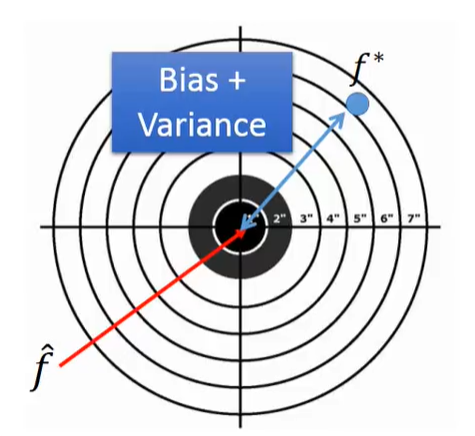
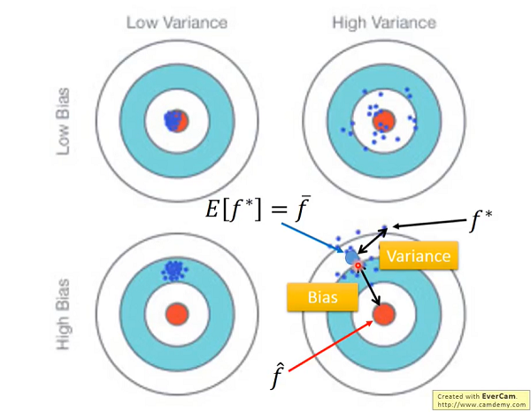
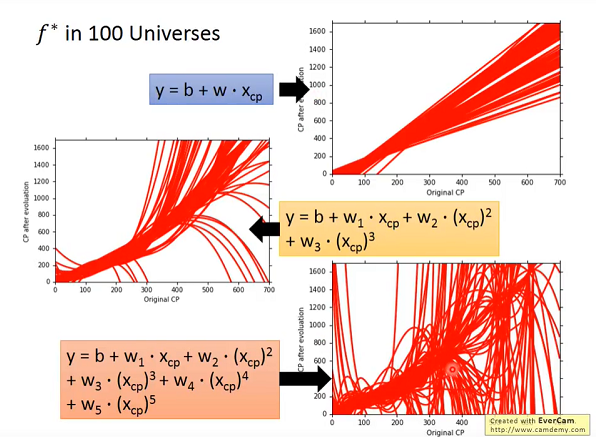
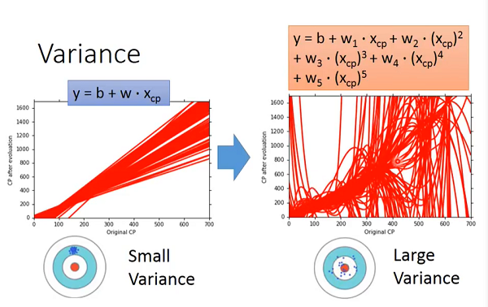
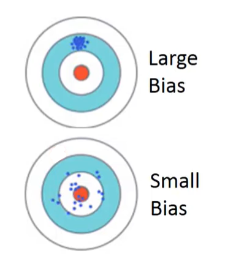
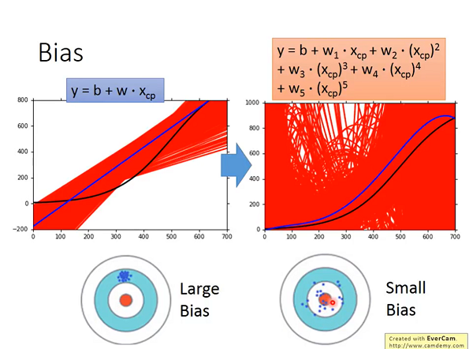

# Hung-yi Lee 学习笔记: Where does the error from?
[学习视频链接](https://www.bilibili.com/video/av48285039/?p=8)  
## 估计值
&emsp;&emsp;从训练数据得到的仅仅是对于当前数据所拟合的模型，记作$f^*$,这个模型是对原始模型\\(\hat f\\)的一个估计
&emsp;&emsp;
## 方差和偏差的估计值
+ 估测变量\\(x\\)的均值
   + 假设\\(x\\)的均值是\\(\mu\\)
   + 假设\\(x\\)的方差是\\(\sigma^2\\)
+ \\(\mu\\)的估计值
   + 取N个样本点:\\(x^1,x^2,...,x^N\\)
   + 算N个样本点的平均值: \\(m=\frac{1}{N}\sum_{i=1}^{N}x^i≠\mu\\),虽然此时的\\(m\\)不等于实际的均值，但\\(m\\)的期望是等于\\(\mu\\)的(不做具体计算)，就像打靶一样,虽然每次打靶的结果不是正中靶心,但是我们是瞄准着靶心去操作的.此时我们可以说我们的估计值是无偏的(unbiased). (无偏估计的数学表示: \\(E[\hat \theta]=\theta\\),\\(\hat \theta\\)为估计值,\\(\theta\\)为实际值)
   + 算N个样本点的方差: \\(s^2=\frac{1}{N}\sum_{i=1}^{N}\(x^i-m\)^2\\),\\(s^2的估计值E[s^2]=\frac{N-1}{N}\sigma^2\\),容易看出估计值是偏小的,这是一个有偏估计
&emsp;&emsp; 
&emsp;&emsp;上图中High Bias和High Variance所对应的子图可以通俗理解为: 在射击过程中首先瞄准的位置就不是红心而是错误的蓝心,所以导致了偏差(Bias),其次由于其他影响导致射击结果距离错误靶心又很分散.这就导致了error的产生. 
## 方差
&emsp;&emsp;使用不同的数据进行模型拟合\\(f^{\*}\\)就像是对着靶子开100枪,产生100个\\(f^{\*}\\)的散布. 
&emsp;&emsp; 
&emsp;&emsp;容易看出只考虑一次的模型其不同的\\(f^{\*}\\)是比较集中的,而随着参数次幂的提升,\\(f^{\*}\\)分布则越来越分散了. 
&emsp;&emsp; 
&emsp;&emsp;可以理解为简单的模型不太会受数据的影响,一个极端的例子: 我们将模型定义为\\(f(x)=c\\)(c是常数),那么无论我们的输出如何,其输出永远是一个恒定不变值,那么其方差(Variance)就是0.
## 偏差
$$E[f^{\*}]=\bar f$$
+ Bias: 如果我们平均所有的\\(f^{\*}\\)，他是接近\\(\hat f\\)的. 
&emsp;&emsp; 
&emsp;&emsp;在小偏差(small bias)的情况下,无论\\(f^{\*}\\)的散布如何,其期望都是接近原始\\(f\\)的. 
&emsp;&emsp; 
&emsp;&emsp;上图中黑色曲线代表原始函数\\(f\\),红色曲线表示5000次实验得到的函数\\(f^{\*}=\bar f\\),蓝色曲线.可以看到随着模型的复杂度提高,预测模型的期望是接近真实模型的,偏差是减小的.但是随着模型复杂度的提高,模型也越来越可能产生过拟合的情形(Over fitting).
## 针对较大方差和较大偏差的解决方法
+ 问题诊断:
   + 如果模型不能拟合训练数据,那么存在较大的bias.(欠拟合)
   + 如果模型可以拟合训练数据,但是在测试数据上存在较大的error,那么很有可能存在较大的variance.(过拟合)
+ 对于较大的bias:
   + 增加更多的特征作为输入
   + 设计更加复杂的模型
+ 对于较大的variance:
   + 搜集更多的数据
   + 正则化
## 模型选择
&emsp;&emsp;使用k折交叉验证方法. 
&emsp;&emsp;将数据集分为k份,其中1份作为验证子集,剩余k-1份作为训练子集,这样可以得到k个不同划分的数据集.而后在这k个数据上使用其中k-1个训练集进行不同的模型的训练，最后使用在不同验证集上误差最小的模型.